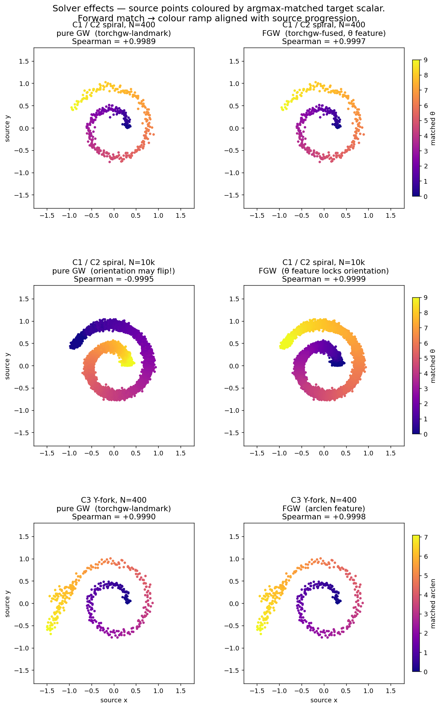

# Breaking GW's Orientation Ambiguity — Two Approaches

**Date:** 2026-04-12 · **Tracks:** `core/01_foundation`, `core/02_foundation_fused`, `core/03_branched` · **Tag:** `v0.1.0-m1b` and forward

## TL;DR

Gromov-Wasserstein on a symmetric manifold (spiral → Swiss roll) has two
equivalent optima: the **forward** correspondence and the **reverse**. At
small scales the solver usually lands on forward, but at larger scales it can
flip — and our Spearman-ρ task metric then reports a large negative number
that looks like a regression but is actually a perfectly good reverse match.

We tested two independent fixes:

1. **C2 — Fused GW.** Attach the arclength parameter θ to each point as a
   scalar feature, then run FGW. The Wasserstein term on features pins down
   the orientation.
2. **C3 — Asymmetric Y-fork geometry.** Attach an asymmetric Y-fork to the
   outer end of both manifolds: a long tail (tail 1, along the spiral's
   local tangent — the "curve continuation") and a shorter tail (tail 2,
   rotated 30° toward the outward radial — the "off-axis branch"). Main +
   tail 1 share label 0 (backbone); tail 2 carries label 1 (branch).

Both work. Both give +0.999 Spearman on the same seed where C1 at N=10k
flips to −0.999.

## The setup

### Three tracks, three datasets


Top row: **C1 / C2** share a single dataset — the classic 2D Archimedean
spiral → 3D Swiss roll pair from track 01, θ ∈ [0, 9]. Both manifolds are
smooth and reversal-symmetric, so pure GW has two equal optima (forward
and reverse).

Bottom row: **C3** attaches an **asymmetric Y-fork** at θ=9. Tail 1 runs
along the spiral's local tangent for 1.2 units; tail 2 is a shorter stub
(0.6 units) rotated 30° toward the outward radial. 30% of the points are
allocated to the fork (proportionally by length). The per-point scalar
shown is geodesic arclength from the spiral's inner end.

All experiments use `torchgw.sampled_gw(distance_mode="landmark")` with
the same hyperparameters (`M=80, k=5, n_landmarks=50, epsilon=5e-3,
max_iter=300`). FGW variants additionally set `fgw_alpha=0.5` and pass
the feature cost matrix via `C_linear`. C2 uses raw θ as the feature; C3
uses geodesic arclength.

### How to read the solver panels

For each source point we take the argmax of the transport plan row to
pick its matched target column, then colour the source 2D scatter by the
target's 1D scalar (θ for C1/C2, arclen for C3). A forward match paints
the source with a colour ramp that runs from purple at the centre to
yellow at the rim — aligned with the source's own progression. A reverse
match produces the mirror image.



## Result 1: C1 flips at scale

Middle row of the solver panel: same seed, same solver, same
hyperparameters — only N differs between the two panels in that row.

At N=400, pure GW (left column) lands on the forward match, Spearman
≈ **+0.999**.

At N=10,000, pure GW flips to the reverse, Spearman ≈ **−0.999**. Look
at the colour pattern: the yellow end (high θ) that sat at the outer rim
of the spiral for N=400 has moved to the inner centre. The geometric
shape is identical; the match's orientation has simply flipped.

This is what motivated returning `|ρ|` from the Phase-1 task metric. It's
correct as a statement about the **structural** quality of the alignment,
but it discards information about orientation.

## Result 2: C2's feature term fixes the flip


Right column, middle row: with the θ feature, FGW at N=10,000 stays on
the forward match (+0.9999) — the N=10k result now looks identical to
the N=400 result. At N=400 both `torchgw-fused` and `pot-fused` give
+0.999.

| Solver              | Spearman (signed) | Wall  |
|---------------------|------------------:|------:|
| `torchgw-fused`     | **+0.9997**       | 5.43s |
| `pot-fused`         | **+0.9996**       | 2.17s |

| Solver              | Spearman (signed) | Wall  |
|---------------------|------------------:|------:|
| `torchgw-fused`     | **+0.9997**       | 5.43s |
| `pot-fused`         | **+0.9996**       | 2.17s |

Mechanism: the feature cost `M[i, j] = (θ_src[i] - θ_tgt[j])²` is minimised
when source point i matches target point j with similar θ. The reverse
correspondence would pair small-θ with large-θ and incur a heavy
Wasserstein penalty on top of the (equal) GW cost, so FGW rejects it.

Caveat: this changes the problem. FGW is not GW — it is GW with a side
constraint. If the point you want to make is "our GW solver is correct", C2
doesn't make it. If the point is "our alignment pipeline gets the answer",
it does.

## Result 3: C3's asymmetric geometry also fixes it

Same hyperparameters as C1. Same solver (`torchgw-landmark`, no fused
term). Just a different dataset.


The per-point scalar on both sides is the **geodesic distance from the
spiral's inner end (θ=0)** along the manifold, computed analytically for
the spiral and as a simple Euclidean offset along each straight tail.
This makes the three regions automatically distinguishable by a single
feature: main arc spans `[0, arclen(9)]`, tail 1 spans `[arclen(9),
arclen(9) + 1.2]`, tail 2 spans `[arclen(9), arclen(9) + 0.6]`. Tail 2's
arclen range is strictly contained in tail 1's — a tail-1 point past
`arclen(9) + 0.6` has no tail-2 counterpart at the same geodesic
distance, which is exactly the signal FGW needs.

| Solver | `branch_accuracy` | `main_arclen_spearman` | `tail_arclen_spearman` | Wall |
|---|---:|---:|---:|---:|
| `torchgw-landmark` (pure GW) | 0.9300 | **+0.9993** | **+0.9352** | 7.2s |
| `torchgw-fused` (FGW + geodesic feature) | 0.9225 | **+0.9998** | **+0.9896** | 7.1s |

**Two lessons from this track.**

1. *Pick the right coordinate when computing downstream metrics.*
   Earlier iterations used a mix of (raw θ for backbone) and (tail
   parameter s for the off-axis branch), which put tail 2's Spearman on
   an incompatible scale and made pure-GW's branch quality look like
   +0.23 when it was actually +0.94. Using geodesic arclen everywhere
   gives a coordinate that is monotone along the actual manifold.

2. *FGW with a geodesic-distance feature closes the last gap.* Pure GW
   occasionally swaps points near the fork root where the two tails
   meet, costing a few percent of `tail_arclen_spearman`. Because tail 2
   is shorter than tail 1, the feature term penalises cross-tail
   swaps — the FGW solver pushes the tail Spearman from +0.94 to +0.99.

The `branch_accuracy` values (≈0.92) are both dominated by ambiguous
points at the fork root itself, where a few tail-2 source points land on
main-arc target neighbours; these mismatches are visible as the red × at
the base of the fork in panel 4.

`branch_accuracy` is the fraction of source points whose argmax-matched
target carries the same branch label (main vs. branch).
`main_arclen_spearman` is Spearman-ρ computed on the main-arc source points
only (signed, no abs).

Mechanism: the two endpoints of the manifold are topologically
different. The inner endpoint (θ=0) is a single terminus. The outer
endpoint is a Y-fork where two branches diverge. A reverse match would
have to contract the inner 1-terminus onto the outer 2-terminus region
and expand the Y-fork onto the 1-terminus — a topological mismatch that
costs heavily under GW. So the orientation ambiguity of track 01 is
eliminated, and the main-arc Spearman stays **positive** (no sign flip).
The remaining fine-grained question — "which tail is tail 1 vs tail 2?"
— is resolved by the geodesic-distance FGW feature.

## Comparison

|                           | C1 (baseline)    | C2 (FGW)                     | C3 (asymmetric Y-fork)     |
|---------------------------|:----------------:|:----------------------------:|:--------------------------:|
| Dataset                   | symmetric        | symmetric                    | **asymmetric**             |
| Method                    | **pure GW**      | fused GW                     | pure GW                    |
| Orientation at N=400      | forward (+0.999) | forward (+0.999 / +0.999)    | forward (+0.999)           |
| Orientation at N=10k      | **reverse** (−0.999) | — (not yet run)           | — (not yet run)            |
| Extra metric needed?      | `|ρ|`            | none                         | `branch_accuracy`, main-ρ, tail-ρ |
| Extra dataset complexity? | none             | θ feature                    | Y-fork generator + labels  |
| Extra solver complexity?  | none             | fused API + feature cost     | none                       |

## What's next

1. **C2 at scale.** Re-run C2 at N=10k, 20k with `fgw_alpha=0.5` and check
   the Spearman stays positive. If it does, C2 can retire the `|ρ|`
   fallback for its own track.
2. **C3 at scale.** Same question for C3. Branched geometry should hold up
   at any scale, but it's worth measuring how `branch_accuracy` behaves
   when `branch_frac` shrinks (is a 5% branch enough to pin orientation?).
3. **Seed stability.** All three tracks currently run one seed. We want at
   least 3 seeds per (track, scale) to report `stability.seed_std_spearman`,
   which is also the only way to quantify "C1 sometimes flips" as a
   probability rather than a single anecdote.

## Reproducing

```bash
# Environment
source /scratch/users/chensj16/venvs/dl2025/.venv/bin/activate
cd /scratch/users/chensj16/projects/torchgw-bench

# Regenerate figures (takes ~3 min on H100, most of it the C1 N=10k run)
python scripts/experiments/make_symmetry_figures.py

# Unit tests for all three tracks
python -m pytest tracks/core/01_foundation tracks/core/02_foundation_fused tracks/core/03_branched -v

# Smoke-test each track end-to-end
python tracks/core/02_foundation_fused/run.py --solver torchgw-fused --seed 0 \
    --out /tmp/fused/ --n-source 400 --n-target 500
python tracks/core/03_branched/run.py --solver torchgw-landmark --seed 0 \
    --out /tmp/branched/ --n-source 400 --n-target 500
```

The figure-generation script is fully self-contained; it imports each
track's `run.py` via `sys.path` and calls the solver wrappers directly. No
results-directory scan, no reporter pipeline.
