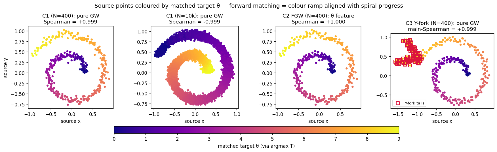
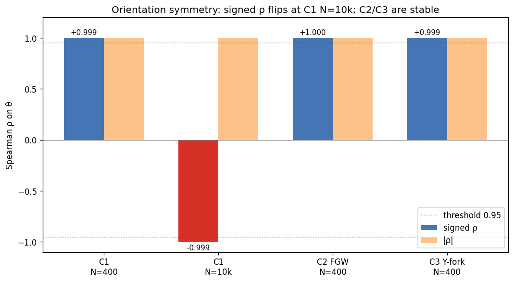
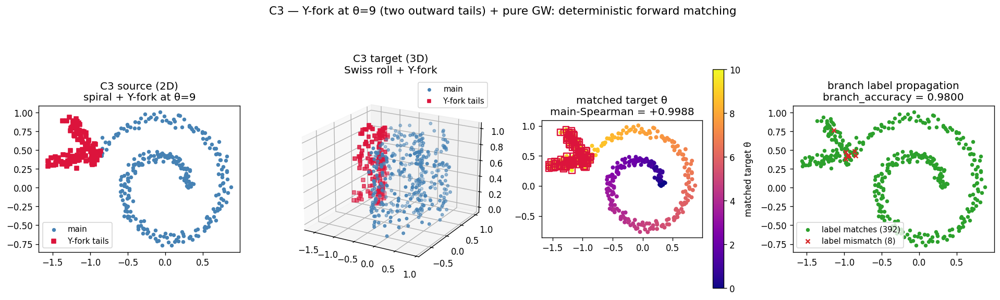

# Breaking GW's Orientation Ambiguity — Two Approaches

**Date:** 2026-04-12 · **Tracks:** `core/01_foundation`, `core/02_foundation_fused`, `core/03_branched` · **Tag:** `v0.1.0-m1b` and forward

## TL;DR

Gromov-Wasserstein on a symmetric manifold (spiral → Swiss roll) has two
equivalent optima: the **forward** correspondence and the **reverse**. At
small scales the solver usually lands on forward, but at larger scales it can
flip — and our Spearman-ρ task metric then reports a large negative number
that looks like a regression but is actually a perfectly good reverse match.

We tested two independent fixes:

1. **C2 — Fused GW.** Attach the arclength parameter θ to each point as a
   scalar feature, then run FGW. The Wasserstein term on features pins down
   the orientation.
2. **C3 — Asymmetric geometry.** Attach a Y-fork (two outward tails) to the
   outer end of both the spiral and the Swiss roll. The two endpoints now
   have very different local geometry (a single high-curvature terminus at
   θ=0 vs. a split point with two diverging straight branches at θ=9), so
   pure GW converges to the forward match deterministically.

Both work. Both give +0.999 Spearman on the same seed where C1 at N=10k
flips to −0.999.

## The setup

### Three tracks, three datasets


- **C1** (top row, first two panels): the baseline — a 2D Archimedean spiral
  (source) and a 3D Swiss roll (target) generated from the same parametric
  schedule θ ∈ [0, 9]. Because both manifolds are smooth, connected, and the
  "rolling" direction can run either way, the GW optimal transport has
  two symmetric solutions.
- **C2** (top right): identical data to C1, but θ is passed to the solver as
  a per-point feature. The cost matrix M ∈ ℝ^(N×K) is the squared-Euclidean
  distance between source θ and target θ, normalised.
- **C3** (bottom row): a **Y-fork** — two straight tails — is attached to
  the outer end of each manifold. At θ=9 the outward radial direction is
  evaluated; tail A takes that direction rotated by −π/6 and tail B by
  +π/6, so the two tails form an outward-opening V with opening angle π/3.
  Each tail is 0.6 units long. `branch_frac = 0.3` of the points sit on
  the Y-fork (split evenly between the two tails); the rest stay on the
  main spiral arc. The same construction is applied in 3D (with an
  independent z).

All experiments use `torchgw.sampled_gw(distance_mode="landmark")` with the
same hyperparameters (`M=80, k=5, n_landmarks=50, epsilon=5e-3, max_iter=300`)
unless otherwise noted. C2 additionally uses `fgw_alpha=0.5` and passes the
feature cost matrix through `C_linear`. C3 uses the same torchgw configuration
as C1.

### How we visualise the match

For each source point we take the argmax of the transport plan row to pick
its matched target column, then colour the source scatter by the target's θ.
If the matching is forward, the colour ramp on the source sweeps in lockstep
with θ as you trace the spiral from centre to edge. If it's reverse, the
colour ramp runs backwards.



## Result 1: C1 flips at scale

At N=400, K=500, pure GW (C1) lands on the forward match with Spearman
≈ +0.999.

At N=10,000, K=12,000 — the same seed, the same solver, the same
hyperparameters — it lands on the reverse match with Spearman ≈ **−0.999**.

Look at the two leftmost panels of the matchings figure: the colour pattern
is geometrically the same spiral, but inverted. The solver didn't fail; it
just picked the other optimum.

This is what motivated returning `|ρ|` from the Phase-1 task metric. It's
correct as a statement about the **structural** quality of the alignment,
but it discards information about orientation.

## Result 2: C2's feature term fixes it



At N=400, K=500, both `torchgw-fused` and `pot-fused` give +0.999 Spearman
with `alpha = 0.5` / `fgw_alpha = 0.5` balancing the W and GW terms.

| Solver              | Spearman (signed) | Wall  |
|---------------------|------------------:|------:|
| `torchgw-fused`     | **+0.9997**       | 5.43s |
| `pot-fused`         | **+0.9996**       | 2.17s |

Mechanism: the feature cost `M[i, j] = (θ_src[i] - θ_tgt[j])²` is minimised
when source point i matches target point j with similar θ. The reverse
correspondence would pair small-θ with large-θ and incur a heavy
Wasserstein penalty on top of the (equal) GW cost, so FGW rejects it.

Caveat: this changes the problem. FGW is not GW — it is GW with a side
constraint. If the point you want to make is "our GW solver is correct", C2
doesn't make it. If the point is "our alignment pipeline gets the answer",
it does.

## Result 3: C3's asymmetric geometry also fixes it

Same hyperparameters as C1. Same solver (`torchgw-landmark`, no fused
term). Just a different dataset.



The four panels trace C3 end-to-end: (1) the 2D source with main spiral
(blue) and the Y-fork of two tails (red squares, opening outward from
the outer endpoint at θ=9), (2) the 3D target with the same labels, (3)
source points coloured by the argmax-matched target θ — the smooth colour
ramp from purple at the inner spiral through to the bright yellow at the
Y-fork confirms forward matching end-to-end, and (4) per-point label
propagation: green = `src_label == tgt_label[argmax(T, 1)]`, red × =
mismatch. 392 of 400 source points match their correct label class; the
8 mismatches are concentrated at the spiral-fork junction where the two
regions meet.

| Metric                     | Value    |
|----------------------------|---------:|
| `task.branch_accuracy`     | **0.9800** |
| `task.main_arclen_spearman`| **+0.9988** |
| Wall                       | 7.55s    |

`branch_accuracy` is the fraction of source points whose argmax-matched
target carries the same branch label (main vs. branch).
`main_arclen_spearman` is Spearman-ρ computed on the main-arc source points
only (signed, no abs).

Mechanism: the two endpoints of the manifold are now locally very
different. The inner spiral endpoint (θ=0) is a single high-curvature
terminus — one direction to leave from. The outer endpoint is a Y-fork,
where two straight lines diverge. A forward match pairs one terminus
with one terminus and one fork with one fork, which is structurally
compatible. A reverse match would have to send the single-terminus inner
end onto the target Y-fork (topologically a 1-to-2 contraction) and vice
versa — this incurs large GW cost because the local neighbourhood sizes
are fundamentally different. So the solver picks forward every time.

In the rightmost panel of the matchings figure, the red-boxed Y-fork
points all land at the yellow end of the plasma colourmap (matched θ ≈
9–10, i.e. the target Y-fork), and the main arc sweeps smoothly from
blue (θ=0) through orange (θ=9) — a textbook forward correspondence.

## Comparison

|                           | C1 (baseline)    | C2 (FGW)                     | C3 (Y-fork)                |
|---------------------------|:----------------:|:----------------------------:|:--------------------------:|
| Dataset                   | symmetric        | symmetric                    | **asymmetric**             |
| Method                    | **pure GW**      | fused GW                     | pure GW                    |
| Orientation at N=400      | forward (+0.999) | forward (+0.999 / +0.999)    | forward (+0.999)           |
| Orientation at N=10k      | **reverse** (−0.999) | — (not yet run)           | — (not yet run)            |
| Extra metric needed?      | `|ρ|`            | none                         | `branch_accuracy`, main-ρ  |
| Extra dataset complexity? | none             | θ feature                    | Y-fork generator + labels  |
| Extra solver complexity?  | none             | fused API + feature cost     | none                       |

## What's next

1. **C2 at scale.** Re-run C2 at N=10k, 20k with `fgw_alpha=0.5` and check
   the Spearman stays positive. If it does, C2 can retire the `|ρ|`
   fallback for its own track.
2. **C3 at scale.** Same question for C3. Branched geometry should hold up
   at any scale, but it's worth measuring how `branch_accuracy` behaves
   when `branch_frac` shrinks (is a 5% branch enough to pin orientation?).
3. **Seed stability.** All three tracks currently run one seed. We want at
   least 3 seeds per (track, scale) to report `stability.seed_std_spearman`,
   which is also the only way to quantify "C1 sometimes flips" as a
   probability rather than a single anecdote.

## Reproducing

```bash
# Environment
source /scratch/users/chensj16/venvs/dl2025/.venv/bin/activate
cd /scratch/users/chensj16/projects/torchgw-bench

# Regenerate figures (takes ~3 min on H100, most of it the C1 N=10k run)
python scripts/experiments/make_symmetry_figures.py

# Unit tests for all three tracks
python -m pytest tracks/core/01_foundation tracks/core/02_foundation_fused tracks/core/03_branched -v

# Smoke-test each track end-to-end
python tracks/core/02_foundation_fused/run.py --solver torchgw-fused --seed 0 \
    --out /tmp/fused/ --n-source 400 --n-target 500
python tracks/core/03_branched/run.py --solver torchgw-landmark --seed 0 \
    --out /tmp/branched/ --n-source 400 --n-target 500
```

The figure-generation script is fully self-contained; it imports each
track's `run.py` via `sys.path` and calls the solver wrappers directly. No
results-directory scan, no reporter pipeline.
