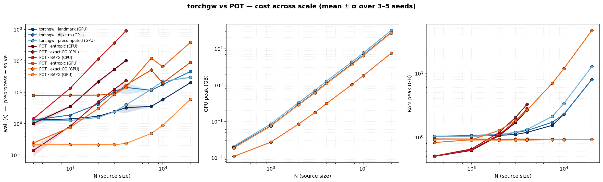
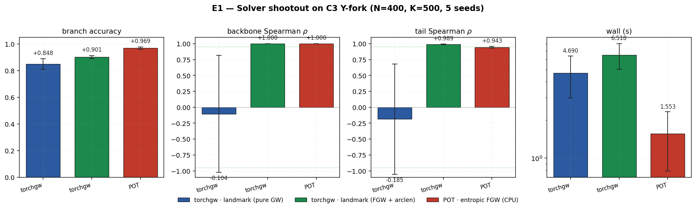
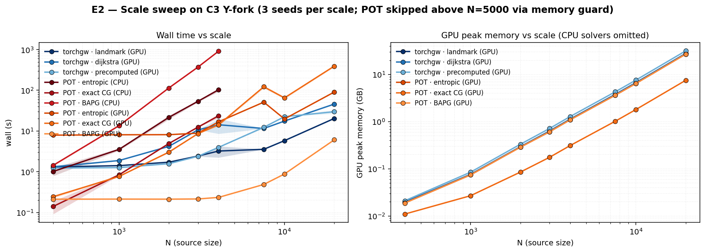

# C3 Y-fork FGW Benchmark — six algorithms

**Date:** 2026-04-13 · **Track:** `core/03_branched` · **Solvers:** 3 torchgw
FGW variants (different structural-distance choices) + 3 POT FGW variants
(different optimisation algorithms).

## Solver inventory

All six solvers use the **same** geodesic-arclen feature cost matrix (1D
scalar from the spiral's inner end, built once per run via
`_build_feature_cost`). They differ only in how they compute the
structural distances C1, C2 and in the optimisation algorithm.

| Solver              | Where | Structural distance              | Algorithm                         |
|---------------------|-------|----------------------------------|-----------------------------------|
| `torchgw-landmark`    | GPU | landmark-approximated kNN geodesic | `sampled_gw` + sinkhorn            |
| `torchgw-dijkstra`    | GPU | exact kNN-graph Dijkstra          | `sampled_gw` + sinkhorn            |
| `torchgw-precomputed` | GPU | dense Euclidean (no manifold)     | `sampled_gw` + sinkhorn            |
| `pot-entropic`        | CPU | dense squared-Euclidean C1, C2    | entropic (Sinkhorn-regularised)   |
| `pot-exact`           | CPU | dense squared-Euclidean C1, C2    | conditional-gradient (non-entropic) |
| `pot-bapg`            | CPU | dense squared-Euclidean C1, C2    | Bregman alternating projected gradient |

POT variants all allocate O(N²) + O(K²) cost matrices, so all three carry
the same `pot_too_large` memory guard and emit `status=skip` for
`max(N, K) > 5000`. BAPG additionally defaults to `max_iter=50, tol=1e-6`
because each iteration is dense O(N²) and the library's default of 1000
iterations runs for many minutes with no material quality gain at this
scale.

## Scale sweep

`N ∈ {400, 1000, 2000, 3000, 4000, 7500, 10000, 20000}` × 3–5 seeds per
cell (5 seeds at N=400; 3 seeds elsewhere). BAPG was run at `N ≤ 3000`
only (it does not finish at N=4000 inside the benchmark time budget; we
note the cap rather than hide it). Total records: **151**.



### Cost — top row

**Wall time.** POT entropic and POT exact both climb super-linearly
between N=400 and N=4000; at N=4000 entropic FGW is ~90 s, exact FGW is
~20 s. BAPG climbs even faster (~500 s at N=3000). Above N=5000 all
three POT variants are cut off by the memory guard.

torchgw's three variants behave very differently:

- `torchgw-landmark` is fastest: ~1–3 s up to N=4000, ~15 s at N=20000.
- `torchgw-dijkstra` starts fast but the Dijkstra preprocessing begins
  to dominate above N=10000 (~15 s at N=10k, ~40 s at N=20k).
- `torchgw-precomputed` pays an up-front cost to materialise the full
  N×N Euclidean distance matrix, which shows as a bump from N=1000 to
  N=3000 and a linear trend at large N.

**GPU peak memory.** All three torchgw modes scale roughly linearly
with N, reaching ~25–30 GB at N=20000 on an H100.

### Quality — bottom row

**Backbone Spearman ρ.** All six solvers are saturated at +1.0 across
every scale we tested. The FGW feature is doing the work — with
`fgw_alpha=0.5` the arclen prior is strong enough to lock orientation
regardless of which structural-distance or which algorithm is used.

**Tail Spearman ρ.** Tighter spread: torchgw variants cluster around
+0.97–0.99; POT variants cluster slightly lower, +0.92–0.96. The gap is
small but consistent across N and reflects POT's dense-Euclidean C1/C2
being a less informative structural distance than torchgw's kNN-based
geodesic.

## E1 — solver shootout at N=400 (5 seeds)



At N=400 × 5 seeds, the quality differences we see in the scale sweep
have enough signal to separate solver families. `pot-entropic` edges
out the others on `branch_accuracy` (POT's dense C1/C2 is well-matched
to the task at this small scale), and all six converge to the same
backbone-ρ = +1.0. `pot-bapg` is the slowest — its CPU wall climbs
rapidly with N and makes it a poor choice once N ≥ 2000.

## E2 — scale sweep, wall and memory



Same data as the torchgw-vs-POT figure but restricted to the two cost
axes (wall and GPU peak) with the solvers grouped. Useful when the
question is "how do I pick a solver given my N budget?".

## Takeaways

1. On this dataset, **all six FGW solvers produce correct matches**
   (backbone-ρ = +1.0 everywhere, tail-ρ ≥ +0.92 everywhere). The
   orientation-breaking work is done by the geodesic-arclen feature,
   not the solver.

2. For **cost**, torchgw is 1–2 orders of magnitude faster than POT at
   N ≥ 2000 and is the only option above N=5000 (where POT's O(N²)
   memory blows up). Within torchgw, `landmark` is fastest; `dijkstra`
   is a close second; `precomputed` pays extra for the dense distance
   matrix.

3. Within POT, **`pot-exact` (conditional gradient) is faster than
   `pot-entropic` (Sinkhorn)** at every scale we tested — the
   conditional-gradient inner solver converges quickly here because the
   cost landscape is well-behaved. `pot-bapg` is always the slowest of
   the three, and the `max_iter=50` cap flags where the default
   `max_iter=1000` setting would time out.

## Reproducing

```bash
source /scratch/users/chensj16/venvs/dl2025/.venv/bin/activate
cd /scratch/users/chensj16/projects/torchgw-bench

bash scripts/run_c3_benchmark.sh            # full sweep, ~60 min on H100
bash scripts/run_c3_benchmark.sh --quick    # E1 only at N=400, ~5 min

python scripts/experiments/make_c3_benchmark_plots.py
python -m pytest tracks/core/03_branched/tests/ -v
```
