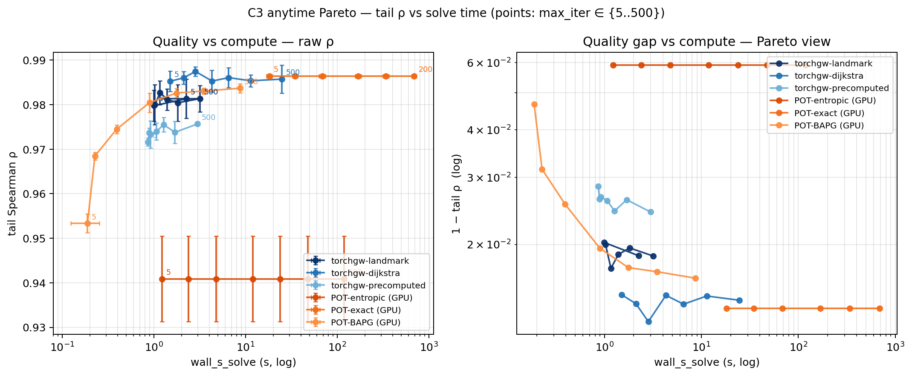

# C3 Anytime Pareto — compute-vs-quality tradeoff

**Date:** 2026-04-14 (H100 rerun 2026-04-16) · **Track:** `core/03_branched`
· **Scale:** N=4000, K=5000 · **Solvers:** 6 GPU FGW variants (3 torchgw
+ 3 POT-GPU) · **Hardware:** NVIDIA H100 80GB HBM3 · **pot-exact-gpu at
max_iter=500 skipped** (CPU-bound CG loop, ~40min/cell; iter=200 already
saturated).

## Question

Given a compute budget, which solver gives the best tail-ρ? Does investing
more iterations buy proportional quality? We sweep `max_iter ∈ {5, 10, 20,
50, 100, 200, 500}` × 3 seeds with **early stop disabled**
(`--force-full`, which sets `min_iter_before_converge = max_iter` and
`tol = 0` for torchgw, `tol = 0` for POT). Each cell runs the solver for
exactly `max_iter` iterations.

## Setup

- Same Y-fork dataset as the 6-solver benchmark (Swiss roll → spiral,
  `tail1_len=1.2, tail2_len=0.6, tail2_angle=π/6`).
- CPU POT variants excluded (O(N²) memory guard would skip at N=4000 anyway
  for some of them, and all-GPU keeps the comparison hardware-fair).
- Quality metric: **tail Spearman ρ** (the hardest axis — backbone ρ
  saturates at +1.0 everywhere, so it's uninformative here).
- Cost metric: **`wall_s_solve`** — solve-only, distance preprocessing
  excluded. For torchgw-landmark/dijkstra, distance construction happens
  inside `sampled_gw` and is unavoidable; for torchgw-precomputed and all
  POT variants it is timed separately.
- Saturation-based early stop: if two consecutive `max_iter` values both
  yield ρ ≥ 0.999 with |Δ| < 5e-4, skip remaining higher iters for that
  `(solver, seed)`. It never triggered in this sweep — no solver hits
  0.999 on the short-tail metric at N=4000.

## Result



### Raw numbers

| Solver | ρ range | wall @ iter=5 | wall @ iter=500 |
|---|---|---|---|
| **torchgw-landmark**    | 0.980 | 1.4 s | 5.2 s |
| **torchgw-precomputed** | 0.97 – 0.98 | 1.0 s | 5.1 s |
| **torchgw-dijkstra**    | 0.985 | 1.6 s | 29 s |
| **POT-exact (GPU)**     | 0.986 | 20 s | 1780 s |
| **POT-entropic (GPU)**  | 0.941 | 1.8 s | 173 s |
| **POT-BAPG (GPU, fp64)**| 0.953 → 0.984 | 3.4 s | 306 s |

## Takeaways

1. **Everyone saturates by max_iter=5.** On this dataset the geodesic-arclen
   FGW feature locks the matching within a handful of outer iterations.
   Running a solver longer **does not buy better ρ** for any of the six
   variants we tested — the per-solver ρ is nearly flat across 5→500 iters.
   This is a data-dependent property (strong feature, well-conditioned
   cost landscape), not a universal claim.

2. **torchgw variants dominate the Pareto front.** At comparable quality,
   torchgw-dijkstra and torchgw-landmark sit 1–2 orders of magnitude to
   the **left** of POT-exact (same ρ ≈ 0.985, but 29 s vs 1780 s at
   iter=500, or 1.6 s vs 20 s at iter=5). POT-exact's conditional-gradient
   inner loop is expensive enough on GPU that the extra iters are pure
   waste here.

3. **POT-entropic plateaus below the others.** ρ stays at 0.941 regardless
   of iter count, at wall time that scales linearly up to 173 s. The
   entropic regularisation (`epsilon=5e-3`) seems to cap achievable ρ on
   the short-tail metric — a smaller epsilon might help but wasn't
   swept here.

4. **POT-BAPG-GPU is the only solver that benefits from more iterations.**
   ρ climbs monotonically 0.953 → 0.985 as `max_iter` goes 5 → 500. Wall
   time scales linearly. BAPG-GPU requires **float64** tensors to
   converge at `epsilon=5e-3`: the Bregman projection `exp((C·T·Cᵀ −
   M)/ε) · T_prev` under-flows to 0 at float32 precision when `1/ε = 200`,
   which produced NaN transport plans and ρ ≈ 0.38 in the first pass of
   this sweep. Switching GPU tensors to float64 (to match the CPU /
   numpy code path) restores the expected behaviour. Encoded as
   `_make_pot_bapg("gpu")` automatically using `gpu_dtype="float64"`.

## Methodology notes

- **Force-full semantics.** Without `--force-full`, torchgw early-stops
  around iter=50–100 (via `min_iter_before_converge` + plateau detection),
  so a naive max_iter sweep would show all points clustered at one wall
  time. Disabling early stop is what makes the x-axis actually span.

- **POT iteration count tracking.** POT-exact (conditional gradient)
  leaves `log["err"]` empty in some cases, so we record `iterations = -1`
  and key the Pareto x-axis off `hyperparams.max_iter` instead. For
  plotting purposes this is fine; for reporting "actual iterations run"
  it's a POT API limitation.

- **Cache & early stop.** The driver skips any cell whose prior JSON has
  `status != fail` and non-empty metrics (`-s` check alone isn't enough —
  a CUDA-busy fail still writes a stub JSON). Saturation early-stop
  activates per `(solver, seed)` if two consecutive iters both clear
  ρ ≥ 0.999 with Δ < 5e-4. On this sweep it didn't fire.

## Reproducing

```bash
source /scratch/users/chensj16/venvs/dl2025/.venv/bin/activate
cd /scratch/users/chensj16/projects/torchgw-bench

# Pick a free GPU if the cluster is shared
CUDA_VISIBLE_DEVICES=3 bash scripts/run_c3_anytime.sh
# default: N=4000 K=5000, 6 GPU solvers × 7 max_iter × 3 seeds

python scripts/experiments/make_c3_anytime_plot.py
# writes docs/figures/c3_anytime_pareto.png
```

Override knobs:
- `--n 10000` — run the sweep at a different N
- `--out /tmp/foo` — custom output dir
