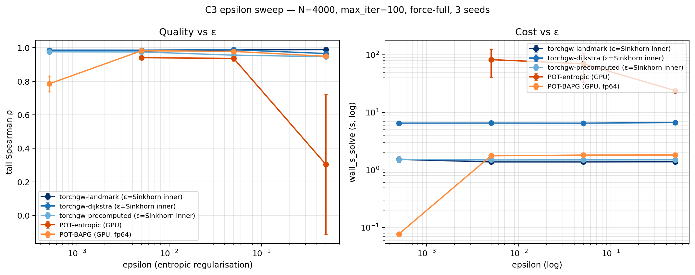

# C3 Epsilon Sensitivity — how robust are the ε-regularised FGW solvers?

**Date:** 2026-04-16 · **Track:** `core/03_branched` · **Scale:** N=4000,
K=5000, max_iter=100, force-full, 3 seeds · **Hardware:** NVIDIA H100
80GB HBM3

## Question

The `pot-entropic` and `pot-bapg` FGW solvers are **Sinkhorn-regularised**
(their FW step does a KL / Bregman projection with strength `ε`). The
torchgw family also uses ε — but only for its **inner** Sinkhorn solve,
not for the outer GW loop. We sweep `ε ∈ {5e-4, 5e-3, 5e-2, 5e-1}` across
four orders of magnitude and ask: which solvers are ε-robust, and which
have a narrow usable window?

Note: **`pot-exact` is not in this sweep** — conditional-gradient FGW is
not entropic-regularised, so it has no ε knob.

## Setup

- All 5 ε-regularised solvers: 3 torchgw + 2 POT-GPU. `pot-bapg-gpu` uses
  `float64` tensors (see 2026-04-14 writeup for the float32 underflow bug).
- Fixed `max_iter=100` with `--force-full` (no early stop).
- Identical Y-fork dataset as the anytime sweep.

## Result



| Solver | ε=5e-4 | ε=5e-3 | ε=5e-2 | ε=5e-1 |
|---|---|---|---|---|
| **torchgw-landmark**    | 0.981 | 0.981 | 0.988 | 0.989 |
| **torchgw-dijkstra**    | 0.986 | 0.986 | 0.989 | 0.966 |
| **torchgw-precomputed** | 0.976 | 0.976 | 0.956 | 0.947 |
| **pot-entropic-gpu**    | **NaN** | 0.941 | 0.937 | **0.304** |
| **pot-bapg-gpu** (fp64) | 0.785 | **0.983** | 0.979 | 0.950 |

Wall time is essentially ε-independent within each solver (±5 %), so the
trade-off is purely quality, not cost.

## Takeaways

1. **torchgw is ε-insensitive.** All three variants hold ρ within a
   ±0.04 band across four orders of magnitude. This is because ε only
   controls the **inner Sinkhorn** that finds a transport plan given a
   fixed cost matrix — the outer GW loop is exact. The only failure is
   precomputed dropping to 0.947 at ε=5e-1 (enough smoothing to blur the
   short tail).

2. **POT-entropic has a narrow usable window.** It fails on **both sides**:
   - ε=5e-4: Sinkhorn denominator under-flows → `NaN` plans
   - ε=5e-1: entropic term overwhelms the transport term → plan collapses
     to the uniform distribution, ρ=0.30 (random)
   The only usable setting here is ε=5e-3 (ρ=0.94). This is structural:
   POT-entropic couples ε directly into the outer FGW objective.

3. **POT-BAPG has a sweet spot at ε=5e-3.** ρ=0.983 — the best of any
   POT solver in this sweep and competitive with torchgw. Away from the
   sweet spot, BAPG degrades more gracefully than entropic: 0.785 at
   ε=5e-4 (converges in 1 iter and bails — too fast) and 0.95 at ε=5e-1.

4. **Practical implication.** The `epsilon=5e-3` default in the 6-solver
   benchmark was not arbitrary — it's the **only viable ε for POT-entropic**
   and the **sweet spot for POT-BAPG**. torchgw would have worked at any
   of the four values tested; if you care about ε-robustness, pick
   torchgw.

## Reproducing

```bash
source /scratch/users/chensj16/venvs/dl2025/.venv/bin/activate
cd /scratch/users/chensj16/projects/torchgw-bench

bash scripts/run_c3_eps_sweep.sh             # 5 solvers × 4 eps × 3 seeds
python scripts/experiments/make_c3_eps_plot.py
```
