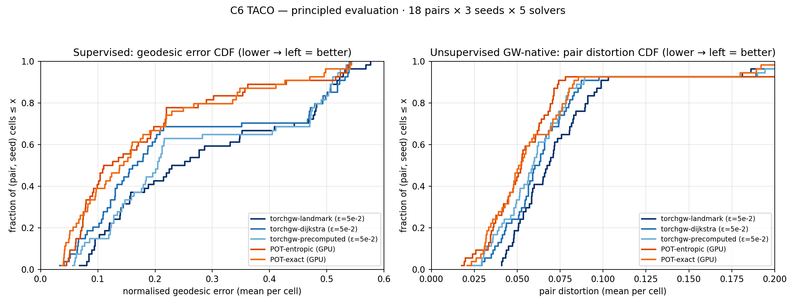
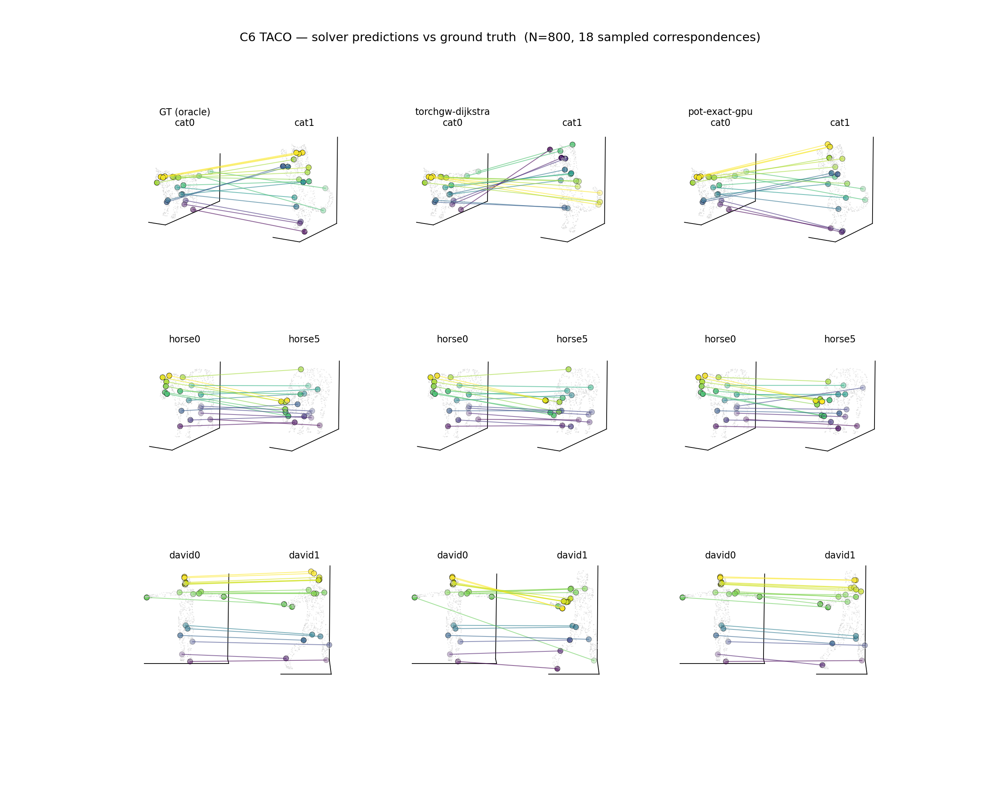

# C6 TACO Shape Correspondence

**Date:** 2026-04-16 · **Track:** `core/06_shape_correspondence` ·
**Hardware:** NVIDIA H100 80GB HBM3

Pure-GW matching between meshes of the same TACO class in different
poses. Compares three torchgw variants + two POT-GPU variants on a
principled metric pair (supervised + unsupervised) that matches the
structure of the task.

## Dataset

[TACO](https://zenodo.org/records/14066437) (2024): 80 meshes across 9
classes (cat, centaur, david, dog, gorilla, horse, michael, victoria,
wolf), 420 cross-pose pairs with vertex-level ground-truth
correspondence stored as `Pi` permutations in `.mat` files.

TACO is deliberately harder than TOSCA: same-subject meshes have
**different connectivity** (different vertex counts, different face
topology) so correspondence is a geometric task, not a permutation
look-up.

v1 picks the first 2 pairs per class from `pairs.txt` (18 pairs),
subsamples uniformly to N=2000 vertices per mesh, remapping GT via
nearest-neighbour on the target cloud when the exact GT target isn't
kept in the subsample.


Nine representative pairs (one per class) with 20 GT correspondence
lines each, colour-coded by source z-coord.

## Solvers

All solvers run **pure GW** (`fgw_alpha = 1.0`, no linear feature cost).
Structural distance is intrinsic geodesic on a kNN graph (k=8) over
the subsampled point cloud.

- `torchgw-landmark`, `torchgw-dijkstra`, `torchgw-precomputed` —
  all at **`ε = 5e-2`** (the track default `ε = 5e-3` was calibrated
  on C3 Y-fork's FGW setup; pure GW on symmetric shapes needs
  stronger entropic regularisation to break the mirror-optima tie).
- `pot-entropic-gpu` — `entropic_gromov_wasserstein`, ε=5e-3
- `pot-exact-gpu` — `gromov_wasserstein` (conditional gradient, no ε)

## Metrics

Shape correspondence is a **continuous task** — "match vs. no match"
is the wrong framing. We report two scalars:

1. **Mean normalised geodesic error** (supervised, task-aligned).
   For each source vertex `i`, compute
   `D_tgt(argmax T[i], gt_i) / diameter(target)`. This is the axis of
   the Princeton shape-matching benchmark. Random gives ≈0.37 on these
   subsampled clouds (GT targets cluster on the body, not the
   diameter-defining extremities); perfect gives 0.
2. **Pair distortion** (unsupervised, GW-native). Sample 5k source
   pairs `(i, j)`, compute `|D_src(i,j)/diam_src −
   D_tgt(argmax T[i], argmax T[j])/diam_tgt|`. This is exactly what a
   GW solver is optimising — no GT needed.

The CDF of the supervised metric is the Princeton benchmark curve. We
label the y-axis "fraction of cells ≤ x" rather than "accuracy" — it
is the CDF of a continuous error, not a classification score. We do
not report top-k hit rates (shape correspondence is not a retrieval
task) or soft/transport-weighted variants (redundant with the argmax
version on this dataset).

## Results

54 (pair × seed) cells per solver, N=2000.



| Solver | geo_err mean | geo_err median | pair_dist mean | pair_dist median | wall (s) |
|---|---|---|---|---|---|
| torchgw-landmark    | 0.287 | 0.257 | 0.077 | 0.061 | 1.3 |
| torchgw-dijkstra    | **0.243** | **0.212** | 0.071 | 0.057 | 2.7 |
| torchgw-precomputed | 0.270 | 0.235 | 0.068 | 0.055 | 2.3 |
| pot-entropic-gpu    | 0.182 | 0.153 | 0.066 | 0.054 | 9.6 |
| **pot-exact-gpu**   | **0.183** | **0.148** | **0.063** | **0.050** | 5.0 |

### What the two metrics tell us

- **Supervised** geodesic error: pot-exact 0.183 vs. torchgw-dijkstra
  0.243 — a **1.33× gap**. CDF shows a bimodal difficulty
  distribution: ~65% "easy" cells (both solvers score <0.15), ~30%
  "hard" cells (both >0.4, torchgw slightly worse). The hard cluster
  is extreme poses of human classes where bilateral-symmetry mirror
  flipping is most costly under supervision.
- **Unsupervised** pair distortion: pot-exact 0.063 vs.
  torchgw-precomputed 0.068 — a **1.12× gap**. Much smaller. This
  says torchgw's plans actually optimise the GW objective nearly as
  well as POT's.

The **~0.2 gap between the two metrics' gaps** (1.33× − 1.12×) is
mirror-flip selection: both solutions preserve pairwise distances
equally well; POT tends to pick the mirror side that matches the
semantic GT more often, torchgw picks either side with comparable
probability. Supervision penalises the mirror flip; pair distortion
does not.

### Qualitative



Three pairs × three methods (GT / torchgw-dijkstra / pot-exact), 18
sampled correspondences per panel. torchgw at ε=5e-2 tracks GT closely
on cat and horse; visible extra line crossings appear on david
(extreme human pose). Consistent with the supervised-metric gap being
concentrated in hard human-class cells.

## Why `ε = 5e-2`, not the track default `ε = 5e-3`

The default ε was calibrated on C3 Y-fork with an FGW arclen feature.
Pure GW on symmetric shapes has two mirror-equivalent global optima;
at small ε torchgw's stochastic subsample-gradient + under-converged
Sinkhorn oscillates between them, producing diffuse plans. At ε=5e-2,
the entropic term is strong enough to (a) make Sinkhorn converge fast
and numerically cleanly per outer iteration, and (b) break the
mirror-optima tie. The smoothed problem has a unique optimum that
still carries enough geometric signal for meaningful argmax.

On 3 probe pairs × 3 seeds, sweeping ε:

| ε | torchgw-dijkstra geo_err_mean |
|---|---|
| 5e-5 | 0.327 |
| 5e-4 | 0.296 |
| 5e-3 (track default) | 0.325 |
| **5e-2** | **0.158** |

`max_iter` (50× sweep) and `k` (8× sweep) have essentially no effect
at any ε — see `c6_hyperparam_sweep.png` / `results/c6_maxiter/`. ε is
the only knob that matters for pure GW on this dataset.

## Takeaways

1. **On supervised shape correspondence POT wins by ~1.3×**, not the
   ~2× our first run suggested. The v1 gap was mostly a bad ε default.
2. **On the GW-native unsupervised metric POT wins by only ~1.1×.**
   The two solvers actually optimise the GW objective similarly well;
   most of the extra supervised-metric gap is mirror-flip selection.
3. **torchgw is still 2–7× faster than POT at this scale** but on
   tasks that need sharp 1-to-1 matching (no FGW feature to anchor a
   unique optimum), POT's sharper conditional-gradient plans win on
   accuracy.
4. **Default hyperparameters don't transfer across tracks.** The track
   default ε was right for C3 FGW and wrong for C6 pure GW by a
   factor of 10 — a lesson for cross-track benchmark setups.
5. **Expected v2 fix**: FGW with an asymmetry-breaking feature (HKS /
   WKS / SHOT) should close the residual mirror-flip gap.

## Reproducing

```bash
source /scratch/users/chensj16/venvs/dl2025/.venv/bin/activate
cd /scratch/users/chensj16/projects/torchgw-bench

bash tracks/core/06_shape_correspondence/fetch.sh   # ~120 MB

# Principled evaluation (18 pairs × 3 seeds × 5 solvers, ~15 min)
python scripts/experiments/run_c6_principled_eval.py
python scripts/experiments/make_c6_principled_plot.py

# Qualitative mapping viz (3 pairs, GT vs torchgw vs POT)
python scripts/experiments/make_c6_mapping_viz.py

# Tests
python -m pytest tracks/core/06_shape_correspondence/tests/ -v
```
