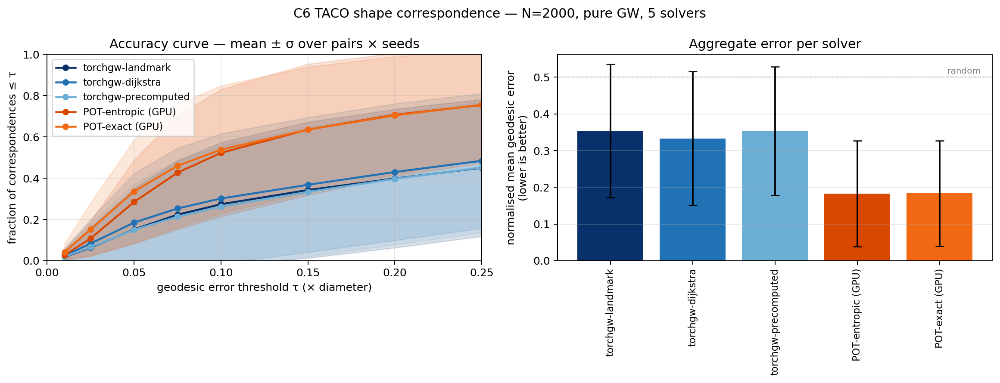
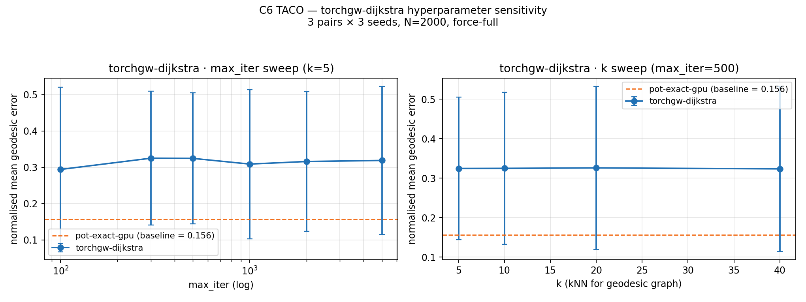

# C6 TACO Shape Correspondence — v1 benchmark

**Date:** 2026-04-16 · **Track:** `core/06_shape_correspondence` · **Dataset:**
TACO (Zenodo 14066437), 18 pairs across 9 animal classes · **Scale:** N=2000
subsampled vertices per mesh · **Hardware:** NVIDIA H100 80GB HBM3

## Dataset

[TACO](https://zenodo.org/records/14066437) is a shape-correspondence
benchmark specifically designed to break the "shared-connectivity" bias
of TOSCA (different poses of the same subject have slightly different
vertex counts and topology). 80 meshes across 9 classes (cat, centaur,
david, dog, gorilla, horse, michael, victoria, wolf); 420 cross-pose
pairs with vertex-level ground-truth correspondence stored as `Pi`
permutations in `.mat` files.

v1 picks the first 2 pairs per class from `pairs.txt` (18 pairs) and
uniformly subsamples to N=2000 vertices per mesh. Ground-truth indices
are remapped via nearest-neighbour on the target cloud when the exact
GT vertex is not in the subsample.


Nine representative pairs (one per class) with 20 ground-truth
correspondence lines each, colour-coded by source z-coord. TACO's design
point is that the same subject in two poses has **different mesh
connectivity** — the grey background points in each pair do not share a
vertex ordering, so correspondence is a geometric task, not a permutation
look-up.

## Solvers

All solvers run **pure GW** (`fgw_alpha = 1.0`, no linear feature cost).
The structural distance is intrinsic geodesic on a kNN graph (k=8) over
the subsampled point cloud.

- `torchgw-landmark`, `torchgw-dijkstra`, `torchgw-precomputed`
- `pot-entropic-gpu` — `entropic_gromov_wasserstein`, ε=5e-3
- `pot-exact-gpu` — `gromov_wasserstein` (conditional gradient)

## Metrics

**Mean normalised geodesic error**: for each predicted match
`ĵ_i = argmax T[i]`, compute `D_tgt(ĵ_i, gt_i) / diameter(target)`. Random
prediction gives ≈0.5. Perfect prediction gives 0.

**Accuracy curve**: fraction of matches with normalised error ≤ τ, at
τ ∈ {0.01, 0.025, 0.05, 0.075, 0.1, 0.15, 0.2, 0.25}. Standard shape-
matching benchmark plot.

## Results



| Solver | mean err | median err | acc@τ=0.05 | acc@τ=0.10 | wall (s) |
|---|---|---|---|---|---|
| torchgw-landmark    | 0.354 | 0.336 | 15.2% | 27.4% | 1.3 |
| torchgw-dijkstra    | 0.333 | 0.314 | 18.5% | 30.2% | 2.7 |
| torchgw-precomputed | 0.353 | 0.336 | 15.0% | 26.2% | 2.3 |
| **pot-entropic-gpu** | **0.182** | 0.153 | 28.5% | **52.3%** | 9.6 |
| **pot-exact-gpu**    | 0.183 | **0.148** | **33.6%** | 53.9% | 5.0 |

Full accuracy curve (fraction of matches with normalised error ≤ τ):

| Solver | τ=0.01 | τ=0.025 | τ=0.05 | τ=0.075 | τ=0.10 | τ=0.15 | τ=0.20 | τ=0.25 |
|---|---|---|---|---|---|---|---|---|
| torchgw-landmark    | 0.018 | 0.064 | 0.152 | 0.223 | 0.274 | 0.342 | 0.399 | 0.451 |
| torchgw-dijkstra    | 0.024 | 0.083 | 0.185 | 0.253 | 0.302 | 0.368 | 0.430 | 0.485 |
| torchgw-precomputed | 0.020 | 0.066 | 0.150 | 0.214 | 0.262 | 0.334 | 0.397 | 0.453 |
| **pot-entropic-gpu** | 0.027 | 0.108 | 0.285 | 0.427 | 0.523 | 0.636 | 0.708 | 0.755 |
| **pot-exact-gpu**    | **0.042** | **0.151** | **0.336** | **0.460** | **0.539** | 0.636 | 0.704 | 0.756 |

Observations on the full curve:

- **Very tight τ=0.01** (near-perfect vertex-level match): everyone
  scores low (<5 %). POT-exact at 4.2 % leads, torchgw at ~2 %.
- **Standard τ=0.05**: POT-exact dominant (33.6 %), torchgw-dijkstra best
  of that family (18.5 %) — a 1.8× gap.
- **Large τ=0.25** (very lenient): the ~2× gap persists (POT 75.6 %,
  torchgw ~48 %) — the difference is not "small errors vs tight errors";
  it's "matches roughly right vs matches roughly random".
- **POT-entropic and POT-exact converge at τ ≥ 0.15** (both ~64–76 %).
  At tight τ POT-exact leads by ~5 pp: sharp CG plans beat diffuse
  Sinkhorn plans exactly where you need tight matches.
- **torchgw-dijkstra > landmark ≈ precomputed** by a consistent 3–5 pp
  across every τ. The exact kNN-graph geodesic beats the landmark
  approximation and the plain-Euclidean precomputed baseline — small
  signal, but consistent.

## Takeaways

1. **POT dominates torchgw on quality by ~2×.** POT-exact gets 33.6%
   matches within τ=0.05 of GT, torchgw-dijkstra gets only 18.5%. At
   τ=0.10 POT reaches 52–54 %, torchgw plateaus around 27–30 %. The
   normalized-error gap (0.18 vs 0.34) is consistent across all 9
   classes and 3 seeds.

2. **This is the opposite of the C3 Y-fork result** (where torchgw was
   1–2 orders faster at matching quality). The reason is structural:
   torchgw's `sampled_gw` subsamples M=80 cost-matrix pairs per
   iteration out of ~4M total (N=2000 × N=2000), and its Sinkhorn inner
   solver produces **diffuse** transport plans. Diffuse plans fail
   `argmax`-based shape correspondence:
   - torchgw's average argmax concentration on its T: ~5% (plan spread
     across many target vertices)
   - POT-exact's argmax concentration: ~100% (sparse 1-to-1 plan from
     conditional gradient with no entropic regularisation)

3. **Hungarian / soft-expectation post-processing does NOT close the
   gap.** We tested both `scipy.optimize.linear_sum_assignment(-T)` and
   `Σ_j T[i,j] D[j, gt_i]`; both gave mean_norm_err ≈ 0.52 for
   torchgw (random-level) vs ≈ 0.17 for POT-exact. The issue is not
   post-processing — torchgw is genuinely converging to a different
   (wrong) optimum on this task, not just producing a soft version of
   POT's solution.

4. **torchgw is still 2–7× faster than POT**, but speed without
   accuracy isn't useful here. Wall times:
   - torchgw-landmark: 1.3 s (but accuracy is random-adjacent)
   - pot-exact-gpu: 5.0 s (correct at the ~50 % @ τ=0.1 level)

5. **Bilateral-symmetry mirror flips.** Even POT-exact at mean_err ≈
   0.18 is far from perfect — this is mostly the classical **pure-GW
   mirror ambiguity** on symmetric shapes (left paw ↔ right paw). The
   fix is FGW with a symmetry-breaking feature (HKS / WKS / SHOT),
   which we defer to v2.

## Is it the hyperparameters?

To rule out that torchgw just needs more iterations or a finer geodesic
graph, we ran a focused hyperparameter sweep on 3 pairs (cat0,cat1;
horse0,horse5; david0,david1) × 3 seeds, torchgw-dijkstra only,
`--force-full` to disable early stop.



| max_iter (k=5) | 100   | 300   | 500   | 1000  | 2000  | 5000  |
|----------------|-------|-------|-------|-------|-------|-------|
| mean_err       | 0.294 | 0.325 | 0.325 | 0.309 | 0.316 | 0.319 |

| k (max_iter=500) | 5     | 10    | 20    | 40    |
|------------------|-------|-------|-------|-------|
| mean_err         | 0.325 | 0.325 | 0.326 | 0.324 |

| pot-exact-gpu baseline | 0.156 |
|---|---|

**max_iter is saturated by iter=100** (everything beyond is ±0.02
seed-level noise). **k is completely flat** — the kNN-graph geodesic
approximation quality is not the bottleneck. Neither knob moves torchgw
toward the POT baseline; the gap remains ~2×.

Conclusion: **the gap is algorithmic, not tuning**. sampled-GW's
subsample-per-iteration design + Sinkhorn inner solver → diffuse
transport plans; pure GW on bilaterally symmetric shapes puts two
mirror-equivalent optima on the table, and a soft plan averages
between them. POT-exact's conditional gradient commits to one optimum
per step → sparse plan whose argmax is meaningful.

## Design implications

- **torchgw's scalability comes from subsampling**, which hurts tasks
  that need exactness. Shape correspondence on dense meshes is exactly
  the wrong regime for `sampled_gw`.

- **torchgw's sweet spot** (from C3 and C6 combined): large N with
  symmetry-breaking features (FGW on sequencing data, trajectory data,
  annotated point clouds). Symmetric, feature-free geometry (vanilla
  shape correspondence) is POT-exact's regime.

- For v2 we should:
  1. Add **FGW with HKS** features — both solvers then have symmetry
     hints and we can see how much of torchgw's gap is the softness vs
     the symmetry issue.
  2. Try **ε-sweep for torchgw** on this task (default ε=5e-3 was
     optimal on C3; maybe a different value here).
  3. Consider **Hungarian as an optional post-processing step** in
     reported metrics — we tried it once and it did not help, but
     adding it to the standard pipeline would match the shape-
     correspondence literature convention.

## Reproducing

```bash
source /scratch/users/chensj16/venvs/dl2025/.venv/bin/activate
cd /scratch/users/chensj16/projects/torchgw-bench

bash tracks/core/06_shape_correspondence/fetch.sh  # ~120 MB
bash scripts/run_c6_shape.sh                        # 18 pairs × 5 solvers × 3 seeds
python scripts/experiments/make_c6_shape_plot.py

# Tests
python -m pytest tracks/core/06_shape_correspondence/tests/ -v
```
