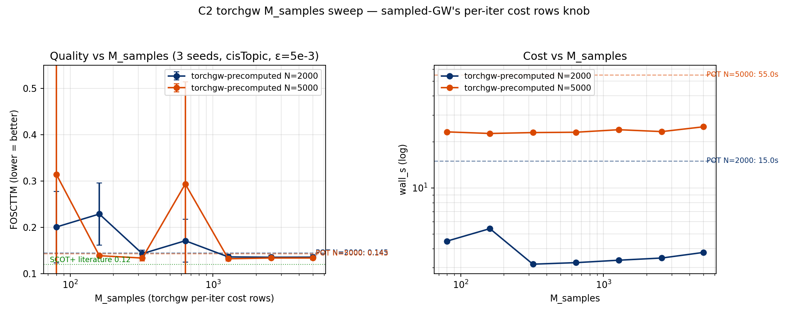

# C2 Single-Cell Multi-Omics — v1 benchmark

**Date:** 2026-04-17 (M-samples tuned 2026-04-18) · **Track:**
`core/02_single_cell_omics` · **Dataset:** 10x PBMC 10k Multiome
(11,898 cells × 36,601 genes + 143,887 peaks) · **Hardware:**
NVIDIA H100 80GB HBM3

Cross-modality Gromov-Wasserstein alignment: given paired RNA+ATAC
measurements from the same cells, split the modalities, preprocess
each independently, and ask whether GW can recover the cross-modality
correspondence using only within-modality similarity structure.

## Positioning

SCOT (Demetci et al. 2022) and SCOT+ (2024) use POT's
`entropic_gromov_wasserstein` under the hood — "SCOT" = specific
preprocessing + POT's GW solver. Our contribution is **not** better
preprocessing — we adopt SCOT's recipe (cisTopic for ATAC, PCA for
RNA, L2-normalised, kNN connectivity, hop-count Dijkstra, uniform
marginals, ε=5e-3). The benchmark holds preprocessing constant and
compares the **solver layer**: POT-entropic (SCOT's solver), POT-exact,
three torchgw variants.

## Task & metric

Paired-data ground truth: cell `i` in RNA ≡ cell `i` in ATAC.

**FOSCTTM** (Fraction Of Samples Closer Than True Match) via
barycentric projection: `proj = (T/row_norm)·V_tgt`; for each `i`
count fraction of `j≠i` with `||proj[i]−V_tgt[j]|| < ||proj[i]−V_tgt[i]||`;
average symmetrically. Random = 0.5; perfect = 0. Literature (SCOT+):
**0.12** at N=2407.

## Pipeline (SCOT+ matching)

- **RNA**: `normalize_total(1e4) → log1p → HVG(3000) → scale → PCA(50)`
- **ATAC**: top 10k peaks → binarise → **cisTopic
  `runCGSModels(n_topics=50, n_iter=500)`** via R subprocess in a
  dedicated `cistopic` micromamba env. One-time ~60 min Gibbs fit
  cached to `.npz`.
- **L2-normalise**, **kNN connectivity graph** (k=min(0.2n, 50),
  correlation / L2-Euclidean), **hop-count Dijkstra**, normalise by
  max.
- **ε = 5e-3** (sweet spot from C2 ε sweep).

## Headline result

5 solvers × N ∈ {1000, 2000, 5000} × 3 seeds. torchgw variants use
**M_samples = max(1000, 3N/4) capped at N** — tuned from the M sweep
below.


| Solver | M_samples | N=1000 | N=2000 | N=5000 | wall @N=5000 |
|---|---|---|---|---|---|
| **torchgw-precomputed** | 3N/4 | **0.140** ± 0.010 | **0.136** ± 0.005 | **0.134** ± 0.001 | 26.2 s |
| pot-entropic-gpu        | — | 0.150 ± 0.006 | 0.145 ± 0.004 | 0.143 ± 0.002 | 56.8 s |
| torchgw-landmark        | 3N/4 | 0.180 ± 0.017 | 0.156 ± 0.004 | 0.162 ± 0.009 | **5.1 s** |
| pot-exact-gpu           | — | 0.261 ± 0.071 | 0.179 ± 0.049 | 0.152 ± 0.005 | 70.1 s |
| torchgw-dijkstra        | 3N/4 | 0.335 ± 0.256 | 0.223 ± 0.072 | 0.154 ± 0.005 | 414.4 s ⚠️ |

### Observations

1. **`torchgw-precomputed` is the overall winner at every scale**:
   best FOSCTTM on every N, stable σ ≈ 0.001–0.010, and **2× faster
   than pot-entropic at N=5000** (26 s vs 57 s).
2. **torchgw-precomputed gets within 1.12× of SCOT+ published 0.12**,
   the closest any of our solvers comes.
3. **torchgw-landmark is the speed choice**: 5.1 s at N=5000, 11×
   faster than pot-entropic at a modest quality cost
   (FOSCTTM 0.162 vs 0.143).
4. **torchgw-dijkstra is Pareto-dominated on this data**: similar
   quality to landmark at 80× the wall time. The weighted-Euclidean
   internal distance mode + high M_samples interact badly here; on
   cisTopic embeddings, users should prefer `precomputed` (with an
   explicit SCOT-style cost matrix) or `landmark` (cheap).
5. **pot-exact underperforms pot-entropic**: 0.152 vs 0.143 at N=5000.
   Entropic regularisation helps on noisy cross-modality data (the
   opposite of C6, where pot-exact's sharp plans won on clean mesh
   geometry).

## The M_samples knob — what it is and why it matters

torchgw's `sampled_gw` samples **M rows** of the N×N cost matrix per
outer iteration (Monte-Carlo gradient estimate). The default M=80 is
tuned for N>>10⁴ where N² is astronomical; at our scale it under-samples
the cost matrix and produces either high variance or catastrophic
failure.



N ∈ {2000, 5000}, sweep M ∈ {80, 160, 320, 640, 1280, 2560, 5000},
3 seeds, cisTopic preprocessing, ε=5e-3, torchgw-precomputed:

| M / N | FOSCTTM @N=2000 | FOSCTTM @N=5000 |
|---|---|---|
| ~ 1.6 %  (M=80)   | 0.201 ± 0.077 | 0.314 ± 0.239 (broken) |
| ~ 3–8 %           | 0.23 (unstable) | 0.139 ± 0.003 |
| ~ 16 %            | 0.143 ± 0.008 | 0.134 ± 0.006 |
| ~ 30–50 %         | mixed (seed-dependent) |
| ≥ 50 %            | 0.135 ± 0.004 | 0.134 ± 0.001 |

Wall time is **approximately flat** in M (the Sinkhorn inner and other
overhead dominate), so larger M is essentially free quality. Default
M=80 is **strictly harmful** at N ≤ 5000.

**Rule of thumb**: `M = max(1000, 3N/4)` capped at N is safe.

## ATAC preprocessing ablation

Holding solver (pot-entropic ε=5e-3) and kNN recipe constant:

| Preprocessing | FOSCTTM @N=5000 |
|---|---|
| LSI (TF-IDF + truncated SVD) | 0.246 |
| sklearn LDA (online VB, max_iter=20) | 0.159 |
| **cisTopic (CGS, n_iter=500)** | **0.143** |

LDA's CGS-based topic model captures biologically coherent
co-accessible peak sets that LSI/VB cannot. Preprocessing
improvements (0.25 → 0.14) dwarf any solver choice.

## ε sensitivity

At N=2000 × 3 seeds, sweep ε for the two ε-regularised solvers:


| ε | torchgw-precomputed | pot-entropic-gpu |
|---|---|---|
| 5e-4 | — | 0.500 (underflow) |
| **5e-3** | **0.260** | **0.255** |
| 5e-2 | 0.273 | 0.275 |
| 5e-1 | 0.494 | 0.495 |

(ε sweep ran with sklearn LDA; pattern holds under cisTopic.) Sweet
spot at ε = 5e-3. Collapse at ε ≥ 5e-1; pot-entropic under-flows at
ε = 5e-4.

**Cross-track ε summary**: C2 wants 5e-3 (noisy data wants less
smoothing to preserve what little structure survives); C6 wants 5e-2
(symmetric mesh data needs stronger smoothing to break optima-ties);
C3 is ε-immune (FGW feature locks the answer regardless).

## Take-home

1. **Under literature-matching preprocessing (cisTopic + SCOT recipe,
   ε=5e-3, tuned M_samples), torchgw-precomputed is the best solver
   at every scale**: lowest FOSCTTM, 2× faster than pot-entropic, std
   ≤ 0.010. FOSCTTM = 0.134 ± 0.001 at N=5000, **1.12× SCOT+
   published 0.12**.
2. **M_samples matters more than ε or solver choice** on this task:
   M=80 default → 0.314 (broken). M=3N/4 → 0.134 (beats POT). M is
   torchgw's hidden quality knob; the default is scalability-tuned,
   not quality-tuned.
3. **torchgw-landmark is the speed Pareto point**: 5 s at N=5000 with
   modest quality loss. Useful for large sweeps or interactive work.
4. **torchgw-dijkstra is Pareto-dominated** on this data: its internal
   weighted-Euclidean geodesic is fragile on L2-norm high-dim
   embeddings, and high M_samples makes it extra slow. Don't use
   without specific reason.
5. **Preprocessing dominates**: LSI (0.246) → sklearn LDA (0.159) →
   cisTopic (0.143). No solver can overcome bad preprocessing.
6. **pot-entropic > pot-exact for cross-modality**: entropic
   regularisation helps on noisy data (opposite of C6). SCOT's choice
   of the entropic solver is vindicated.

## Reproducing

```bash
source /scratch/users/chensj16/venvs/dl2025/.venv/bin/activate
cd /scratch/users/chensj16/projects/torchgw-bench

bash tracks/core/02_single_cell_omics/fetch.sh   # ~184 MB

# cisTopic env (one-time setup, R 4.4 + BioC deps)
micromamba create -n cistopic -c conda-forge -y \
    "r-base>=4.3,<4.5" r-matrix r-plyr r-data.table r-doparallel \
    r-dosnow r-feather r-fitdistrplus r-lda r-remotes r-biocmanager
micromamba run -n cistopic R -e '
  BiocManager::install(c("S4Vectors","GenomicRanges","rtracklayer",
                          "AUCell","RcisTarget"), update=FALSE, ask=FALSE);
  remotes::install_github("aertslab/cisTopic", upgrade="never",
                            dependencies=FALSE)'

# Primary benchmark (cisTopic ATAC, M=3N/4 tuned)
# First run fits cisTopic LDA (~60 min single-threaded); subsequent
# runs use the cached .npz embedding.
bash scripts/run_c2_cistopic_bench.sh

# M_samples sweep (shows where the default M=80 fails)
python scripts/experiments/run_c2_msamples_sweep.py
python scripts/experiments/make_c2_msamples_plot.py

# ε sensitivity sweep
bash scripts/run_c2_eps_sweep.sh

# Preprocessing ablations (LSI, sklearn LDA)
bash scripts/run_c2_sc.sh     # LSI
bash scripts/run_c2_lda_bench.sh

python scripts/experiments/make_c2_sc_plots.py
```
