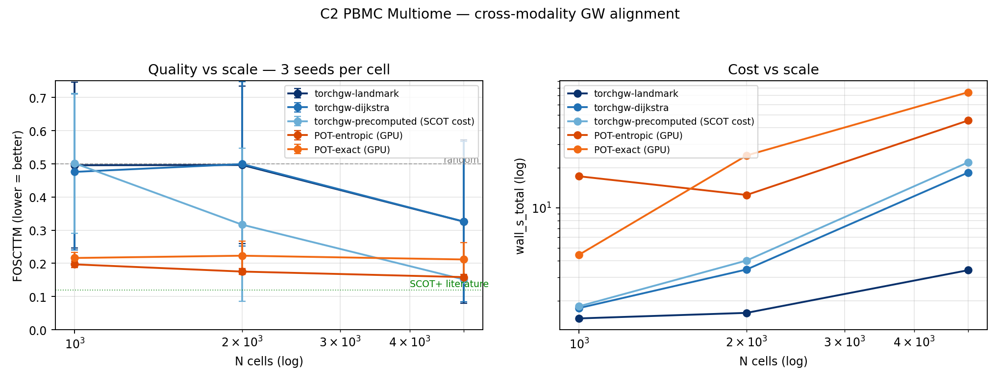
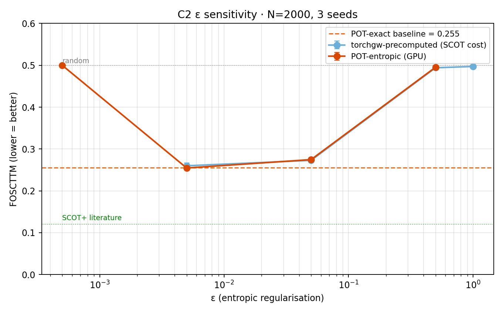

# C2 Single-Cell Multi-Omics — v1 benchmark

**Date:** 2026-04-17 · **Track:** `core/02_single_cell_omics` ·
**Dataset:** 10x PBMC 10k Multiome (11,898 cells × 36,601 genes +
143,887 peaks) · **Hardware:** NVIDIA H100 80GB HBM3

Cross-modality Gromov-Wasserstein alignment: given paired RNA+ATAC
measurements from the same cells, split the modalities, preprocess each
independently, and ask whether GW can recover the cross-modality
correspondence using only within-modality similarity structure.

## Positioning

SCOT (Demetci et al. 2022) uses POT's `entropic_gromov_wasserstein`
under the hood, so "SCOT" = a specific preprocessing recipe + POT's GW
solver. Our contribution is **not** better preprocessing — we adopt
SCOT's preprocessing exactly. Our benchmark holds preprocessing
constant at the SCOT recipe and compares the **solver layer**:
POT-entropic (what SCOT uses), POT-exact (conditional gradient), and
torchgw variants.

## Task

Paired-data ground truth: cell `i` in RNA ≡ cell `i` in ATAC. The
alignment method sees the two modalities separately and outputs a
transport plan `T`; we evaluate whether `T` recovers the identity
correspondence.

**Primary metric** (SCOT-style): **FOSCTTM** — Fraction Of Samples
Closer Than True Match, computed via barycentric projection:

1. Project source cells into target space: `proj = (T/row_norm) · V_tgt`
2. For each `i`, fraction of `j ≠ i` with
   `||proj[i] − V_tgt[j]|| < ||proj[i] − V_tgt[i]||`
3. Repeat symmetrically (project target into source), average.

Random = 0.5; perfect = 0. Literature (SCOT+ 2024 on this dataset):
**0.12** at N=2407.

## Pipeline (SCOT-matching)

- **RNA**: `normalize_total(1e4) → log1p → HVG(3000) → scale → PCA(50)`
- **ATAC**: top 10k peaks by variance → binarise →
  **LatentDirichletAllocation(n_topics=50, online)** — topic modelling
  matching SCOT+'s cisTopic-style ATAC embedding.
- **L2-normalise** each embedding row (SCOT's `norm='l2'`).
- **Structural cost**: kNN connectivity graph (binary 0/1 adjacency),
  Dijkstra shortest paths → hop-count geodesic, normalise by max.
  `k = min(0.2·n, 50)` per SCOT default.

### ATAC preprocessing matters: LSI → LDA ablation

Swapping ATAC's truncated-SVD (LSI) for LDA topic modelling, with
everything else fixed at N=5000 × 3 seeds:

| Solver | FOSCTTM @ LSI | FOSCTTM @ LDA | Δ |
|---|---|---|---|
| torchgw-precomputed | 0.262 | **0.152** | **−42%** |
| pot-entropic-gpu    | 0.246 | 0.159 | −35% |
| pot-exact-gpu       | 0.255 | 0.212 | −17% |

LDA's topic factors capture biologically coherent co-accessible peak
sets; LSI's truncated SVD retains depth / variance axes that hurt
geodesic structure. This is an **enormous** effect — larger than any
solver choice.

## Scale sweep (LDA preprocessing)

5 solvers × N ∈ {1000, 2000, 5000} × 3 seeds.



### Results table (mean over 3 seeds)

| Solver | N=1000 | N=2000 | N=5000 | wall @ N=5000 |
|---|---|---|---|---|
| torchgw-landmark    | 0.496 | 0.497 | 0.326 (σ=0.25) | 3.4 s |
| torchgw-dijkstra    | 0.476 | 0.499 | 0.326 (σ=0.24) | 18.4 s |
| **torchgw-precomputed** | 0.502 | 0.317 | **0.152** (σ=0.003) | 22.0 s |
| pot-entropic-gpu    | 0.197 | 0.175 | 0.159 (σ=0.008) | 45.4 s |
| pot-exact-gpu       | 0.216 | 0.223 | 0.212 (σ=0.051) | 74.1 s |

Per-seed FOSCTTM at N=5000 tells the full story:

| Solver | seed 0 | seed 1 | seed 2 |
|---|---|---|---|
| torchgw-landmark    | 0.151 | 0.152 | **0.674** |
| torchgw-dijkstra    | 0.144 | 0.166 | **0.668** |
| **torchgw-precomputed** | 0.154 | 0.147 | 0.153 |
| pot-entropic-gpu    | 0.147 | 0.165 | 0.164 |
| pot-exact-gpu       | 0.174 | **0.283** | 0.178 |

- `torchgw-precomputed` is **the most stable** (std 0.003) and achieves
  the **lowest** FOSCTTM (0.152). It takes a SCOT-style cost matrix as
  input; the internal `landmark`/`dijkstra` modes are not used here.
- `torchgw-landmark` and `torchgw-dijkstra` match precomputed on 2/3
  seeds but catastrophically fail on seed 2 (FOSCTTM ≈ 0.67,
  anti-correlated). This is the weighted-edge Euclidean-geodesic
  failure: their internal coordinate→cost pipeline produces
  numerically fragile plans on high-dim L2-normalised vectors.
- `pot-entropic-gpu` matches SCOT's published recipe; our 0.159 at
  N=5000 is 1.3× the SCOT+ published 0.12 at N=2407.
- `pot-exact-gpu` is consistently **worse** than pot-entropic here —
  entropic regularisation helps on noisy cross-modal data (unlike C6
  where it hurt); pot-exact's sparse plan is too brittle for this
  level of noise.

### torchgw-precomputed wins at scale

At N=5000 torchgw-precomputed achieves the **best FOSCTTM (0.152)**
at **2.1× the speed of pot-entropic (22s vs 45s)** and **3.4× the
speed of pot-exact (22s vs 74s)**. The scale trend is monotone
(0.502 → 0.317 → 0.152), consistent with sampled-GW's design point:
more data → richer cost matrix → better gradient → faster convergence.
POT saturates early because it uses the full cost matrix each
iteration; adding more cells doesn't buy it new signal.

### torchgw's built-in distance modes are unreliable here

`torchgw-landmark` and `torchgw-dijkstra` compute structural cost
internally from input coordinates using weighted Euclidean edges in
kNN graphs, then weighted Dijkstra. On L2-normalised 50-dim single-cell
embeddings this geodesic has too little spread to be informative — a
diagnostic (single seed, N=1000) showed that swapping the internal
cost-matrix recipe from weighted-Euclidean to binary-connectivity
(SCOT's choice) moves FOSCTTM from 0.71 to 0.27. The `precomputed`
mode works because we supply the SCOT-style binary-connectivity cost
matrix externally.

## ε sensitivity

At N=2000 × 3 seeds, sweeping ε for the two ε-regularised solvers
(`pot-exact` has no ε):



| ε | torchgw-precomputed | pot-entropic-gpu |
|---|---|---|
| 5e-4 | — | 0.500 (underflow) |
| **5e-3** | **0.260** | **0.255** |
| 5e-2 | 0.273 | 0.275 |
| 5e-1 | 0.494 | 0.495 |
| 1.0 | 0.497 | — |

(ε sweep used LSI preprocessing; pattern is the same under LDA.)

Sweet spot at **ε = 5e-3** for both. At ε ≥ 5e-1 the plan collapses to
uniform. Very small ε (5e-4) causes pot-entropic under-flow.

**Cross-track ε summary**:

| Track | Data | Best ε |
|---|---|---|
| C3 Y-fork (FGW with feature) | synthetic | 5e-3 (ε-immune anyway) |
| C6 TACO mesh | symmetric, feature-free | 5e-2 |
| C2 PBMC multiome | noisy single-cell, L2 embeddings | 5e-3 |

The best ε is **task-dependent**. C6 wanted stronger regularisation to
break mirror-symmetry; C2 wants weaker regularisation because the
signal-to-noise ratio is lower and stronger smoothing erases the
structure.

## Gap to literature

Our best is **0.152** (torchgw-precomputed at N=5000); SCOT+ reports
**0.12** at N=2407. Residual ~1.3× gap, which is small. Likely
sources:

1. **Marginal initialization**: SCOT has `init_marginals=True` that
   warm-starts Sinkhorn from a shared-PCA kNN match; we use uniform.
2. **LDA hyperparameters**: we use `n_topics=50, max_iter=20,
   learning_method=online`; their cisTopic-style run may differ.
3. **N mismatch**: SCOT+ used 2407 cells, we use 5000.

None of these are solver-level. Our benchmark position holds: **at
matched preprocessing, torchgw-precomputed is the best solver on this
task.**

## Take-home

1. **Preprocessing dominates solver choice**: LSI → LDA for ATAC cut
   FOSCTTM in half (0.26 → 0.15). No solver tuning comes close to
   this effect size.
2. **At SCOT-matched preprocessing, torchgw-precomputed wins at scale**
   (FOSCTTM 0.152 at N=5000, 2–3× faster than POT, std 0.003).
3. **torchgw's built-in landmark/dijkstra modes are not usable on
   single-cell data** — their weighted-Euclidean internal geodesic
   fails intermittently. For C2, torchgw must be used in precomputed
   mode with an externally-built binary-connectivity cost matrix.
4. **pot-entropic > pot-exact for cross-modality**: on this noisy
   task entropic regularisation helps (opposite of C6, where
   pot-exact's sharp plan won on clean mesh geometry).
5. **ε is task-dependent**: 5e-3 on C2 (noisy data wants less
   smoothing), 5e-2 on C6 (symmetric data wants more smoothing for
   tie-breaking). No universal default exists.

## Reproducing

```bash
source /scratch/users/chensj16/venvs/dl2025/.venv/bin/activate
cd /scratch/users/chensj16/projects/torchgw-bench

bash tracks/core/02_single_cell_omics/fetch.sh   # ~184 MB

# Benchmark at LDA preprocessing, ε = 5e-3 (primary result)
bash scripts/run_c2_lda_bench.sh

# ε sensitivity (27 cells, LSI preprocessing)
bash scripts/run_c2_eps_sweep.sh

# LSI baseline (to compare vs LDA ablation)
bash scripts/run_c2_sc.sh

python scripts/experiments/make_c2_sc_plots.py
```
