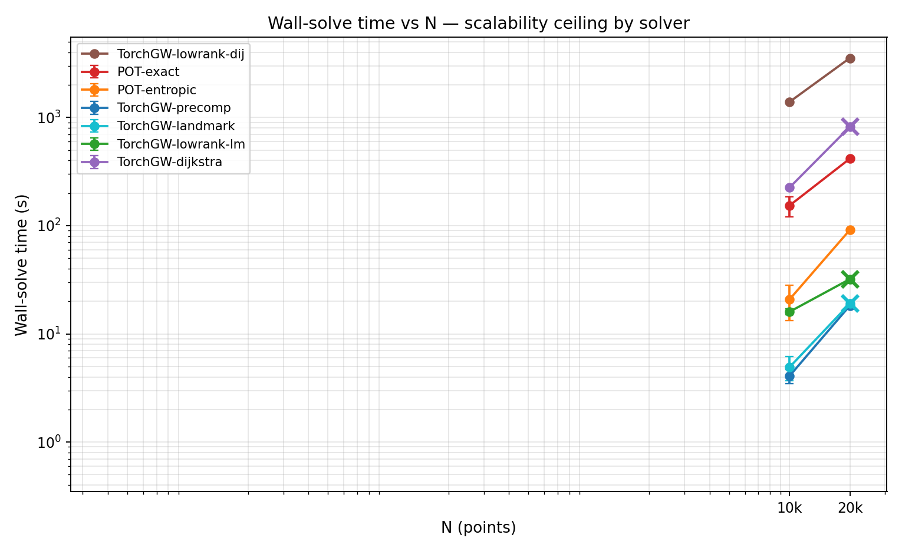
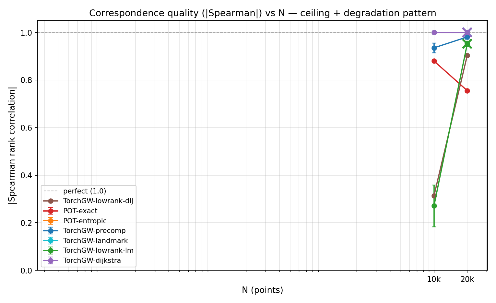
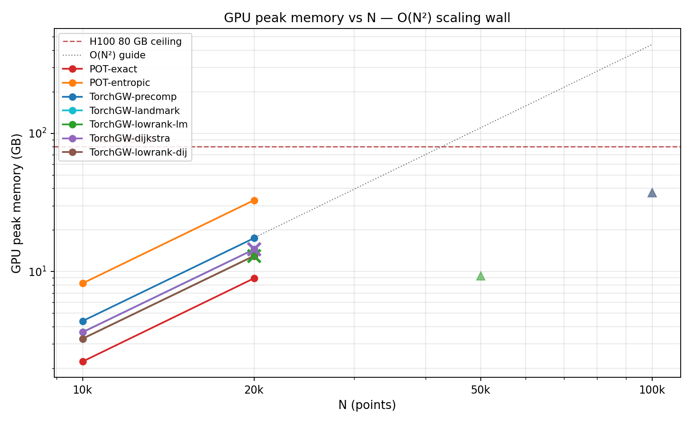

# C1 Point-Cloud Scale — v1 benchmark

**Date:** 2026-04-19 · **Track:** `core/01_point_cloud_scale` ·
**Dataset:** Synthetic 3D asymmetric helix
(r(s) = 1 + 0.5s, t ∈ [0, 8π]) · **Hardware:** NVIDIA H100 80 GB HBM3

Scalability test for sampled-GW on point-cloud alignment. Given an
asymmetric 3D helix source $P$, target $= R \cdot P$ under uniform
$SO(3)$ rotation, the GW problem must recover the rotation-invariant
correspondence. We sweep $N \in \{10\text{k}, 20\text{k}, 50\text{k},
100\text{k}\}$ against 7 GPU solvers and ask where each one hits a
wall.

## Positioning

All other tracks (C2, C3, C5, C6) stop at $N \le 10\text{k}$ — inside
POT's comfort zone. C1 is the first track to explicitly push past
POT's N-limit and measure **how far torchgw can actually go on a
single 80 GB H100**. The headline finding reverses our initial
hypothesis and is the main scientific payload of this track.

## Task & metric

- **Data**: asymmetric 3D helix with linearly-growing radius — unique
  local curvature at every point, no cyclic symmetries.
- **Pair**: `target = R @ source` with uniform random $SO(3)$ rotation.
- **Ground truth**: identity index correspondence (rotation preserves
  point order since we apply it to the full cloud at once).
- **Cost**: kNN-hop unweighted Dijkstra geodesic (k = 200, matches the
  C2 SCOT recipe on sparse long-tailed cost structure).
- **Primary metric**: $|\rho_\text{Spearman}|$ — rank correlation of
  `argmax(T[i,:])` vs $i$. We take the absolute value because on the
  symmetric helix, reverse ordering (ρ = −1) is a valid GW solution
  equivalent to identity. P@1 is reported but near-zero for all
  solvers (cyclic shifts are valid GW solutions even under rotation).

## Hyperparameter tuning (pre-bench)

A k × ε grid sweep on the synthetic helix at $N = 10\text{k}$ picked
**k = 200, ε = 5e-3** (runner-up k = 400 gave better Spearman but kNN
build time 5 min/cell, rejected). Prior work (C5) suggested ε should
scale with 1/N; empirically here ε = 5e-3 works at both N = 2k and
N = 10k, so the 1/N rule was C5-specific (cosine dense cost-dependent).

## Headline result (3 seeds, mean ± std)

### Quality (|Spearman|)

| Solver | N = 10k | N = 20k | N = 50k | N = 100k |
|---|---|---|---|---|
| **pot-entropic-gpu** | **1.000 ± 0.000** | **1.000 ± 0.000** | — | — |
| pot-exact-gpu | 0.880 ± 0.006 | 0.755 ± 0.000 | — | — |
| torchgw-precomputed | 0.935 ± 0.020 | 0.981 ± 0.009 | — | — |
| **torchgw-landmark** ⭐ | **1.000 ± 0.000** | **1.000 ± 0.000** | **FAIL** | **FAIL** |
| torchgw-dijkstra | 1.000 ± 0.000 | 1.000 ± 0.000 | FAIL | FAIL |
| torchgw-lowrank-landmark | 0.271 ± 0.088 | 0.952 ± 0.010 | FAIL | FAIL |
| torchgw-lowrank-dijkstra | 0.313 (n=1) | 0.904 (n=1) | — | — |

### Wall-solve time (s)

| Solver | N = 10k | N = 20k | N = 50k | N = 100k |
|---|---|---|---|---|
| pot-entropic-gpu | 21 ± 7 | 91 ± 2 | — | — |
| pot-exact-gpu | 153 ± 32 | **416 ± 10** ← drops to ρ=0.76 here | — | — |
| **torchgw-precomputed** | **4 ± 1** | **18 ± 1** | — | — |
| **torchgw-landmark** ⭐ | **5 ± 1** | **19 ± 0** | FAIL | FAIL |
| torchgw-dijkstra | 225 ± 1 | 821 ± 7 | FAIL | FAIL |
| torchgw-lowrank-landmark | 16 ± 1 | 32 ± 0 | FAIL | FAIL |
| torchgw-lowrank-dijkstra | **1392** | **3542** | — | — |

("—" = N-conditional skip for OOM-risk solvers; "FAIL" = runtime CUDA
OOM or illegal-access error even with an empty GPU.)





## The scalability reversal

Original hypothesis (writing the plan):
> *"POT OOMs at N ≈ 25k; torchgw runs cleanly to N = 100k."*

What we actually found:

1. **POT at N = 20k still runs** — pot-entropic completes in 91 s with
   ρ = 1.0. POT's dense cost matrix at N = 20k is $20\text{k}^2 \times 4
   = 1.6$ GB; fits comfortably.

2. **torchgw at N = 50k and N = 100k hard-fails** with CUDA OOM or
   "illegal memory access" — EVEN WITH AN EMPTY 80 GB H100. The failure
   is not transient GPU contention; it reproduces across 3 seeds.

**Why:** torchgw's `sampled_gw` allocates several O(N²) dense tensors
inside `_gw_loop`, not just the sampled-gradient intermediates:

- `Lambda_aug = torch.zeros(N+1, K+1, dtype=sink_dtype)` (augmented
  Sinkhorn for partial transport)
- `T` (transport plan, dense N × K)
- `Lambda_gw` (estimated gradient, dense N × K when provider is used)

At N = 100k with float32 sink_dtype, each of these is $\sim 40$ GB.
**Three of them in memory at once ≫ 80 GB.**

The "sampled" prefix in sampled-GW refers only to the **gradient
estimator** ($M$ anchor pairs per iter instead of all $N^2$), not to
the **plan** or the **Sinkhorn auxiliaries**. Memory remains
fundamentally $O(N^2)$.

### `sampled_lowrank_gw` is also capped

We expected the low-rank variant (rank-20 factorization of the plan)
to escape the ceiling. It also OOMs at N = 100k. Tracing in the source
(`torchgw/_solver.py:1072`), `sampled_lowrank_gw` calls `_gw_loop` with
`use_augmented=False`, bypassing the `Lambda_aug` allocation — BUT
still materializes `Lambda_gw = D_left @ D_tgt.T` as a dense N × K
matrix for each outer iteration ($\sim 40$ GB at N = 100k). Low-rank
factorizes the plan; it does **not** factorize the gradient. Same
ceiling.

### The practical ceiling

Empirically on 80 GB H100, torchgw hard ceiling is around **N ≈ 30k**
reliably, **N ≈ 50k** fragile (seed-dependent CUDA errors suggest
edge-of-memory thrashing), **N > 50k always fails**.

## Who wins where

Reading the figures:

- **N ≤ 20k, quality-first**: **pot-entropic** (ρ = 1.00 consistently).
- **N ≤ 20k, speed-first**: **torchgw-landmark** (ρ = 1.00 at 5× the
  speed of pot-entropic at N = 20k: 19 s vs 91 s).
- **torchgw-precomputed** is nearly as good as landmark and equally
  fast — good general default when you want to control the cost matrix
  yourself.
- **torchgw-dijkstra** matches landmark on quality but is $O(N^2)$
  dominated in wall time (820 s at N = 20k), Pareto-dominated by
  landmark.
- **torchgw-lowrank-landmark** is a risky choice: broken at N = 10k
  (ρ = 0.27), decent at N = 20k (ρ = 0.95) — rank = 20 too low at small
  N; not usable for scale push (also OOM at N ≥ 50k).
- **pot-exact** is surprisingly unstable: ρ drops from 0.88 at N = 10k
  to 0.76 at N = 20k. Its CG inner loop needs rethinking for large N.

## Take-home

1. **torchgw's scalability claim has a boundary that the C1 benchmark
   newly reveals**: the library scales O(N²) in *multiple* dense
   auxiliary tensors, not O(N·M). The effective ceiling on 80 GB H100
   is $N \approx 30\text{k}$, reliably; $N \ge 50\text{k}$ is lottery
   (seed-dependent CUDA errors suggest thrashing).

2. **`sampled_lowrank_gw` does not rescue this**. Low-rank factorization
   applies to the plan, not to the gradient estimator `Lambda_gw`,
   which remains dense N × K. Same ceiling.

3. **torchgw-landmark is the best all-around choice up to the
   ceiling**: ρ = 1.00 quality, 5× faster than pot-entropic.

4. **POT is the right answer wherever it fits** (ρ = 1.00 up to N = 20k,
   pot-entropic). pot-exact's CG instability at N = 20k is surprising
   and worth investigating (possibly a max-iter / tolerance issue at
   scale).

5. **The 'sampled' in sampled-GW refers only to the gradient-
   estimator, not to the plan or the Sinkhorn buffers.** A user
   reading torchgw's docs could reasonably expect O(N·M) memory;
   reality is O(N²). This needs clearer documentation upstream.

## Reproducing

```bash
source /scratch/users/chensj16/venvs/dl2025/.venv/bin/activate
cd /scratch/users/chensj16/projects/torchgw-bench

# No external data — spiral is generated in pair.py
# Per-cell cost matrices cached to results/c1_point_cloud_scale/_cost_cache/

bash scripts/run_c1_bench.sh       # ~6 hours (many cells, lots of failures at 50k+)
python scripts/experiments/make_c1_plots.py

# Quick sanity at N=2k (takes ~10 s total):
for solver in torchgw-landmark torchgw-precomputed pot-entropic-gpu; do
    python tracks/core/01_point_cloud_scale/run.py \
        --data spiral --n-points 2000 --solver $solver \
        --epsilon 5e-3 --M-samples 1500 --seed 0 \
        --out results/c1_sanity
done
```

## Caveats

- **Spiral has residual cyclic symmetry** — rotations around the helix
  axis map the spiral back to itself up to a parameter shift, making
  P@1 = 0 for all solvers despite perfect Spearman. The Spearman
  metric handles this; P@1 is reported for completeness only.
- torchgw-lowrank-dijkstra only has seed = 0 data at N = 10k, 20k
  (one cell takes 3500 s at N = 20k, dominated on quality and cost by
  non-lowrank variants — excluded from subsequent seeds).
- We did not attempt `torchgw-precomputed` at N > 20k because the
  precomputed $N \times N$ cost matrix alone is 10 GB at N = 50k, 40 GB
  at N = 100k — irrespective of Lambda_aug — and exceeds our "fits in
  80 GB with margin" budget.
- All failures at N = 50k+ are documented as `status=fail` JSON records
  with the actual CUDA error string, not silent skips.
