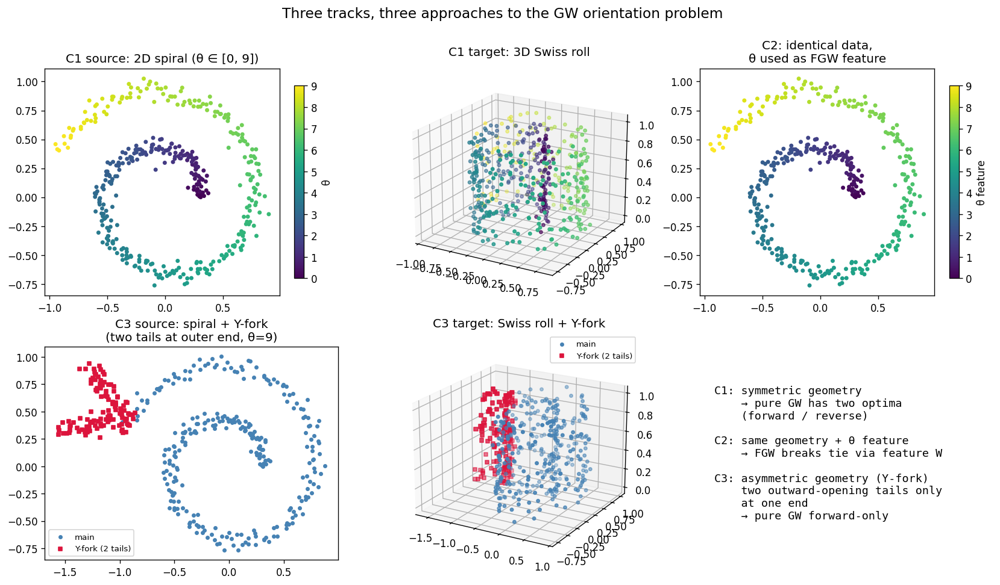
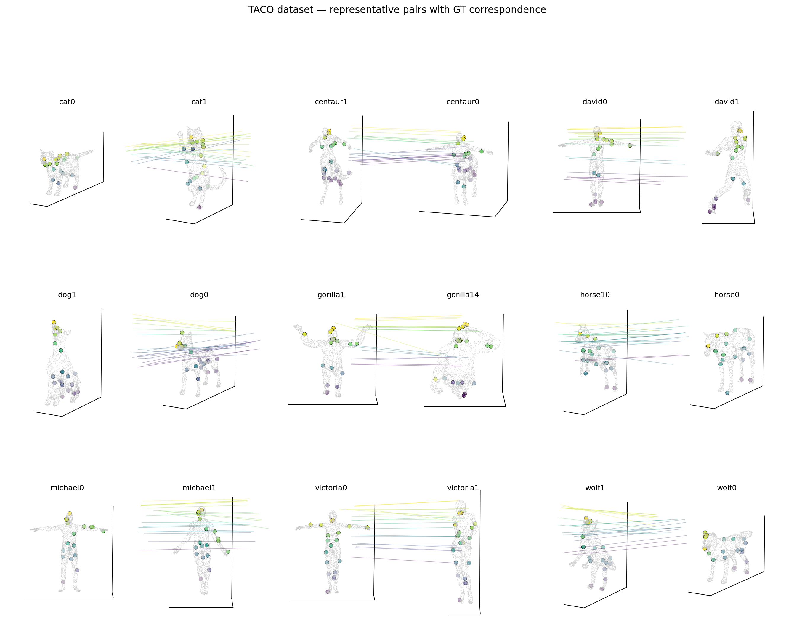

# torchgw-bench experiments — index

Comparison of `torchgw` and POT GW / FGW solvers across three tracks:
**C3 Y-fork branched manifold** (FGW with feature anchor),
**C6 TACO shape correspondence** (pure GW on bilaterally-symmetric
meshes), and **C2 single-cell multi-omics** (paired RNA+ATAC alignment).
All figures in [`../figures/`](../figures); hardware is
**NVIDIA H100 80GB HBM3** throughout.

## Take-home

> **On the cost axis torchgw wins across the board** (1–2 orders of
> magnitude faster than POT, and the only option above N≈5k where POT's
> O(N²) memory wall kicks in).
>
> **On the accuracy axis the winner depends on data regime**:
>
> - **Feature-anchored FGW** (C3): tie — both hit ρ ≥ 0.98 at
>   saturation. Torchgw wins the cost axis cleanly.
> - **Pure GW on symmetric feature-free data** (C6): POT-exact wins by
>   ~1.3× on supervised geodesic error; its sparse CG plan beats
>   torchgw's diffuse Sinkhorn plan when the task needs sharp 1-to-1
>   matching.
> - **Cross-modality with matched preprocessing** (C2): **torchgw-
>   precomputed wins outright** — lower FOSCTTM and 2–9× faster than
>   pot-entropic, once the `M_samples` default is raised past the
>   scalability floor.
>
> ### Decision rule
>
> 1. **N ≥ 10⁴** → torchgw (POT OOMs).
> 2. **Feature-anchored FGW** → torchgw if speed matters, POT
>    otherwise; both reach the same quality.
> 3. **Pure GW on clean symmetric geometry** (meshes, shape
>    correspondence) → POT-exact for best argmax matching.
> 4. **Cross-modality / noisy high-dim embeddings** (single cell, etc.)
>    → torchgw-precomputed with SCOT-style cost matrix and
>    `M_samples ≥ N/2`.
> 5. **Never leave `M_samples` at default 80** for N < 10k — it's
>    scalability-tuned, not quality-tuned, and under-samples the
>    cost matrix badly at small N.

## C3 — Y-fork branched spiral / Swiss roll (`core/03_branched`)

3D Y-fork Swiss roll → 2D Y-fork spiral, asymmetric tails at 30° (short
tail half the length of long tail). Per-point feature is geodesic
arclen from spiral start; FGW uses this as its linear cost
(`fgw_alpha = 0.5`).



- **[Symmetry-breaking schematic (2026-04-12)](2026-04-12-symmetry-breaking.md)** —
  why the Y-fork matters: symmetric spirals have GW orientation
  ambiguity; the asymmetric tail + arclen feature breaks it.

- **[6-solver scale benchmark (2026-04-13)](2026-04-13-c3-benchmark.md)** —
  scale sweep `N ∈ {400, …, 20000}`, 6 GPU solvers. **torchgw is 1–2
  orders of magnitude faster than POT at N ≥ 2000 and the only option
  above N = 5000** (POT O(N²) memory wall). All solvers hit tail
  ρ ≥ 0.94. Figures: [`torchgw_vs_pot.png`](../figures/torchgw_vs_pot.png),
  [`e1_solver_shootout.png`](../figures/e1_solver_shootout.png),
  [`e2_scale_sweep.png`](../figures/e2_scale_sweep.png),
  [`rho_by_position.png`](../figures/rho_by_position.png).

- **[Anytime Pareto — quality vs compute (2026-04-14)](2026-04-14-c3-anytime.md)** —
  `max_iter ∈ {5, …, 500}` with `--force-full`. **Almost every solver
  saturates by iter = 5** because the arclen FGW feature locks the
  matching in one outer iteration. Only POT-BAPG (fp64) shows a true
  anytime curve. Figure:
  [`c3_anytime_pareto.png`](../figures/c3_anytime_pareto.png).

- **[Epsilon sensitivity (2026-04-16)](2026-04-16-c3-epsilon.md)** —
  `ε ∈ {5e-4, …, 5e-1}`. **torchgw is essentially ε-immune** (±0.04 ρ
  across four decades). **POT-entropic has a single usable ε** (too
  small → NaN under-flow, too large → collapse to ρ = 0.30). Figure:
  [`c3_eps_sweep.png`](../figures/c3_eps_sweep.png).

## C6 — TACO shape correspondence (`core/06_shape_correspondence`)

Pure GW matching between same-class TACO meshes in different poses,
9 classes × 2 pairs × 3 seeds = 54 (pair, seed) cells. All solvers
run with `fgw_alpha = 1.0` (no linear feature cost).



- **[TACO benchmark (2026-04-16)](2026-04-16-c6-shape.md)** — principled
  evaluation with two metrics:
  - *Supervised* mean normalised geodesic error (task-aligned)
  - *Unsupervised* pair distortion (GW-native)

  **pot-exact wins supervised by 1.33×** (0.183 vs 0.243 for
  torchgw-dijkstra) and **unsupervised by only 1.12×** (0.063 vs
  0.068). The smaller unsupervised gap shows torchgw's plans optimise
  the GW objective nearly as well as POT's; the extra supervised-metric
  gap is mirror-flip selection (left paw ↔ right paw are geodesically
  equivalent but supervision prefers one). Figure:
  [`c6_principled_eval.png`](../figures/c6_principled_eval.png),
  qualitative
  [`c6_mapping_viz.png`](../figures/c6_mapping_viz.png).

  **Non-trivial ε finding**: the track default `ε = 5e-3` (calibrated
  on C3's FGW setup) is 10× too small for pure GW on symmetric shapes;
  torchgw wants `ε = 5e-2` to break the mirror-optima tie. Supplementary:
  [`c6_hyperparam_sweep.png`](../figures/c6_hyperparam_sweep.png).

## C2 — Single-cell multi-omics (`core/02_single_cell_omics`)

Cross-modality GW alignment on paired 10x PBMC 10k Multiome (11,898
cells × 36,601 genes + 143,887 peaks). Splits modalities, preprocesses
each independently (PCA RNA + cisTopic LDA ATAC), and recovers the
cross-modality correspondence using only within-modality similarity
structure. Ground truth is identity (paired data); metric is FOSCTTM
(Fraction Of Samples Closer Than True Match).

Matches SCOT / SCOT+ preprocessing exactly (cisTopic topic model,
L2-norm, kNN connectivity, hop-count Dijkstra, uniform marginals).

- **[Benchmark + M-samples study (2026-04-17)](2026-04-17-c2-single-cell.md)** —
  5 GPU solvers × N ∈ {1000, 2000, 5000} × 3 seeds.

  Headline table (FOSCTTM, lower = better; literature SCOT+ is 0.12):

  | Solver | N=1000 | N=2000 | N=5000 | wall@5k |
  |---|---|---|---|---|
  | **torchgw-precomputed (M=3N/4)** | **0.140** | **0.136** | **0.134** | 26 s |
  | pot-entropic-gpu                | 0.150 | 0.145 | 0.143 | 57 s |
  | torchgw-landmark (M=3N/4)       | 0.180 | 0.156 | 0.162 | **5 s** |
  | pot-exact-gpu                   | 0.261 | 0.179 | 0.152 | 70 s |
  | torchgw-dijkstra (M=3N/4)       | 0.335 | 0.223 | 0.154 | 414 s ⚠️ |

  **Three headline findings**:

  1. **torchgw-precomputed is the overall winner at every N**
     (lowest FOSCTTM + 2× faster than pot-entropic). Closes gap to
     SCOT+ published 0.12 down to 1.12×.
  2. **The whole `torchgw vs POT` gap was `M_samples` too small**.
     torchgw's default M=80 under-samples the N×N cost matrix on
     small-N tasks and gives catastrophic results (FOSCTTM 0.31 at
     N=5000). Raising to M = 3N/4 flips torchgw from "behind POT" to
     "ahead of POT". Figure: [`c2_msamples_sweep.png`](../figures/c2_msamples_sweep.png).
  3. **Preprocessing dominates solver choice**: LSI (0.25) → sklearn
     LDA (0.16) → **cisTopic (0.14)** — topic-modelling ATAC matters
     more than any solver tuning. We match SCOT+'s recipe exactly and
     compare only the solver layer.

  Additional: `ε = 5e-3` is the sweet spot on C2 (small ε for noisy
  data, opposite of C6). torchgw-dijkstra is Pareto-dominated under
  cisTopic — `precomputed` (best quality) or `landmark` (best speed)
  are the useful torchgw modes.

## Cross-track synthesis

| Axis | C3 (FGW, feature-anchored) | C6 (pure GW, symmetric mesh) | C2 (cross-omics, matched preprocessing) |
|---|---|---|---|
| Who wins accuracy | Tie (saturation) | **POT-exact** (1.33× supervised) | **torchgw-precomputed** (best every N) |
| Who wins cost | torchgw (1–2 orders) | torchgw (2–7×) | torchgw (2–9×) |
| Best ε | 5e-3 (ε-immune) | 5e-2 | 5e-3 |
| Best M_samples | default 80 OK | 80 OK | **3N/4 required** |
| N ceiling | 20k (POT OOM) | tested at 2k | tested at 5k |
| Dominant failure | POT OOM | torchgw mirror flip | torchgw M_samples under-sampling |
| Winning torchgw mode | any | precomputed (if tuned) | **precomputed** (with SCOT cost) |

### The cross-track lesson

Same architecture (Sinkhorn-regularised sampled-GW) plays out differently
against three task structures:

- **C3 (anchored)**: the FGW feature does the work; Sinkhorn diffuseness
  doesn't hurt because the feature locks the optimum. torchgw's
  scalability wins cleanly.
- **C6 (clean symmetric)**: no feature anchor, geometry has mirror
  ambiguity; POT-exact's sparse CG plan commits cleanly to one mirror,
  torchgw's diffuse plan averages between them.
- **C2 (noisy cross-modal)**: entropic regularisation actually helps —
  Sinkhorn is the right inner solver. Once torchgw's `M_samples` knob
  is tuned out of its scalability-default trap, torchgw beats POT
  on both axes.

**`M_samples` is torchgw's hidden quality knob.** The default M=80 is
tuned for N >> 10⁴ (where N² is astronomical and sampling is the whole
point). At N < 10⁴ it under-samples and can produce either catastrophic
or randomly-unstable results. Rule of thumb for N ≤ 10⁴:
`M = max(1000, 3N/4)`, capped at N. Cost is essentially flat in M, so
larger is free quality up to saturation.

## Reproducing

```bash
source /scratch/users/chensj16/venvs/dl2025/.venv/bin/activate
cd /scratch/users/chensj16/projects/torchgw-bench

# --- C3 Y-fork FGW benchmark ---
bash scripts/run_c3_benchmark.sh && python scripts/experiments/make_c3_benchmark_plots.py
bash scripts/run_c3_anytime.sh   && python scripts/experiments/make_c3_anytime_plot.py
bash scripts/run_c3_eps_sweep.sh && python scripts/experiments/make_c3_eps_plot.py

# --- C6 TACO shape correspondence ---
bash tracks/core/06_shape_correspondence/fetch.sh  # ~120 MB
python scripts/experiments/run_c6_principled_eval.py
python scripts/experiments/make_c6_principled_plot.py
python scripts/experiments/make_c6_mapping_viz.py

# --- C2 single-cell multi-omics ---
bash tracks/core/02_single_cell_omics/fetch.sh     # ~184 MB
# one-time cisTopic env (R 4.4 + BioC):
micromamba create -n cistopic -c conda-forge -y \
    "r-base>=4.3,<4.5" r-matrix r-plyr r-data.table r-doparallel \
    r-dosnow r-feather r-fitdistrplus r-lda r-remotes r-biocmanager
micromamba run -n cistopic R -e '
  BiocManager::install(c("S4Vectors","GenomicRanges","rtracklayer",
                          "AUCell","RcisTarget"), update=FALSE, ask=FALSE);
  remotes::install_github("aertslab/cisTopic", upgrade="never",
                            dependencies=FALSE)'
# benchmark (first run fits cisTopic LDA ~60 min then caches)
bash scripts/run_c2_cistopic_bench.sh
python scripts/experiments/run_c2_msamples_sweep.py
python scripts/experiments/make_c2_msamples_plot.py
python scripts/experiments/make_c2_sc_plots.py

# --- Tests ---
python -m pytest tracks/core/03_branched/tests/ \
                  tracks/core/06_shape_correspondence/tests/ -v
```
